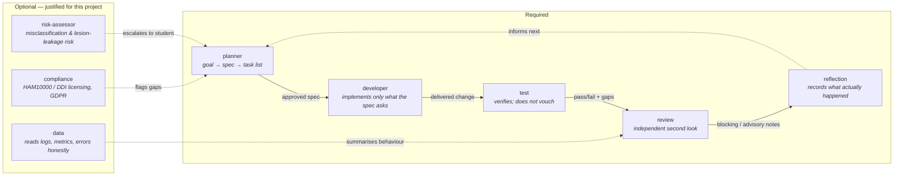
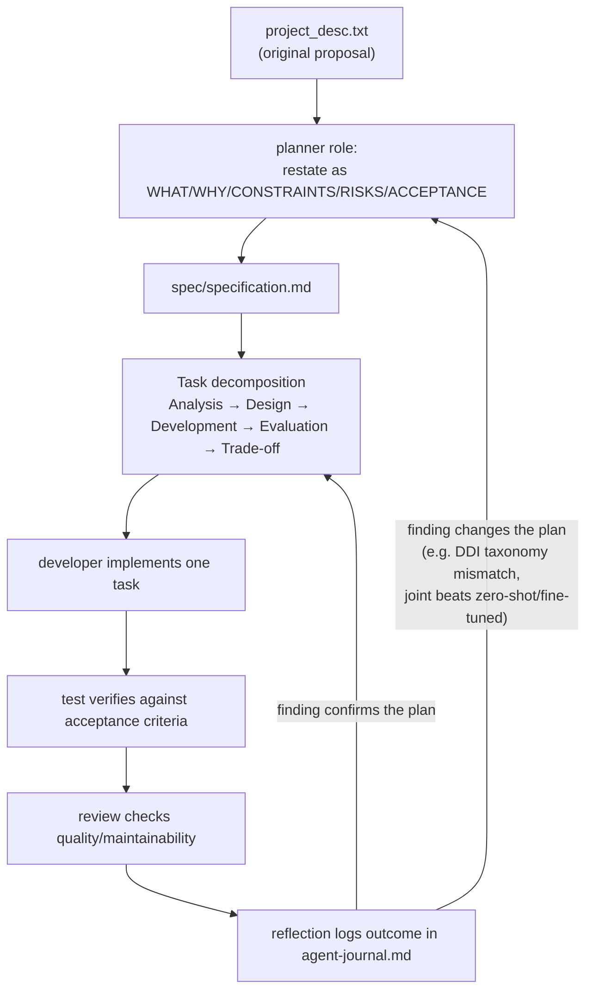
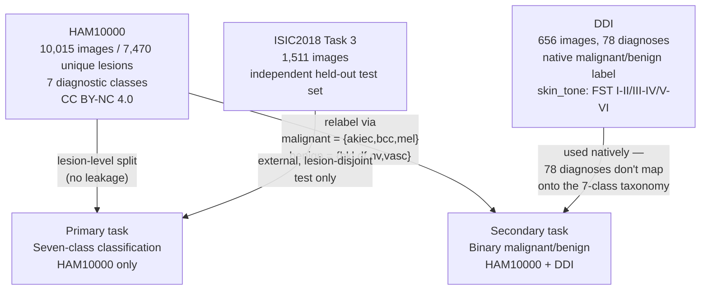
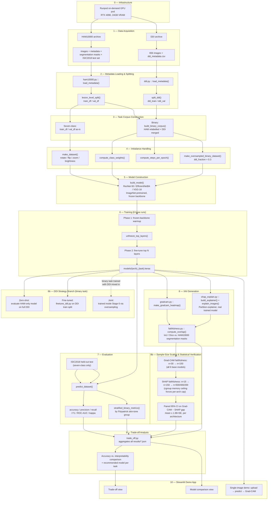
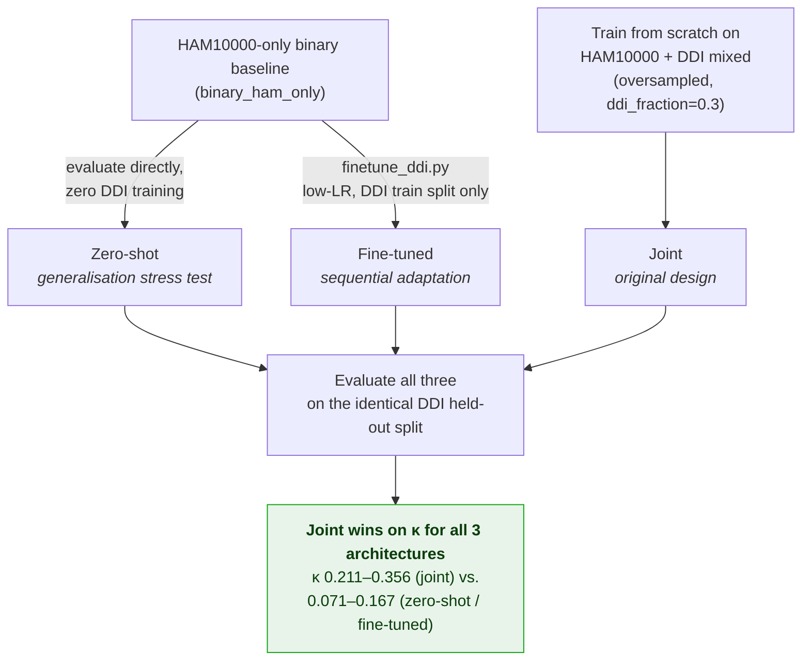
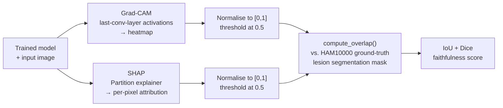
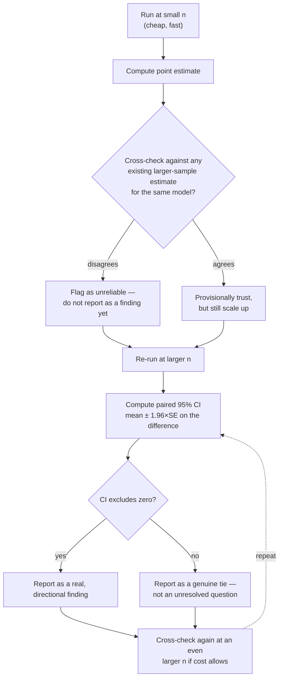
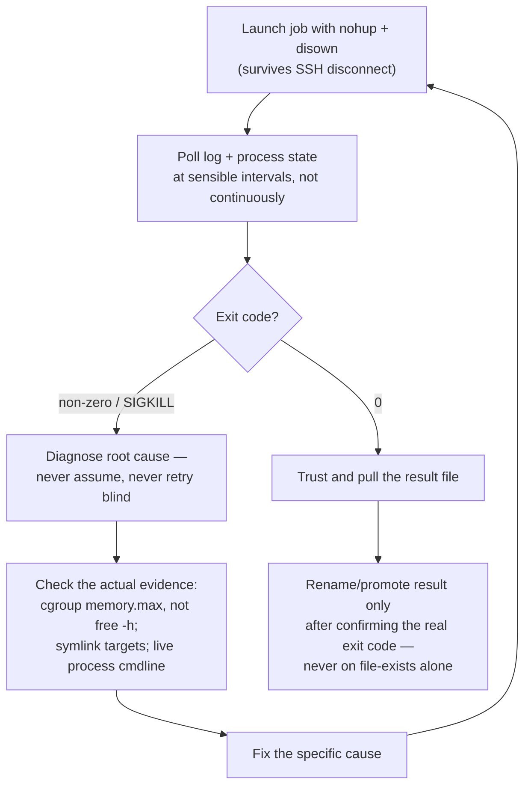
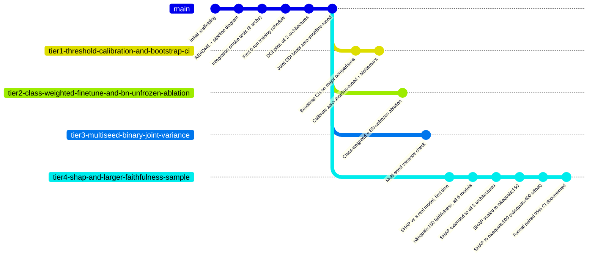

# Methodology

This document scaffolds **every methodology used across this project's development** —
both the *research* methodology (how the ML experiments were designed, run, and
verified) and the *process* methodology (how the work itself was governed, planned,
and recorded). It is a companion to `README.md` (system/pipeline status),
`spec/specification.md` (the WHAT/WHY/CONSTRAINTS/RISKS form), and
`journal/agent-journal.md` (the full reflective log this document summarises).

> Diagrams are [Mermaid](https://mermaid.js.org/) and render natively on GitHub.

## Contents

1. [Governance-driven development process](#1-governance-driven-development-process)
2. [Specification-first workflow](#2-specification-first-workflow)
3. [Dataset & task design](#3-dataset--task-design)
4. [Technical ML pipeline](#4-technical-ml-pipeline)
5. [Model architecture & training methodology](#5-model-architecture--training-methodology)
6. [Evaluation methodology](#6-evaluation-methodology)
7. [DDI fairness methodology — three competing strategies](#7-ddi-fairness-methodology--three-competing-strategies)
8. [Explainability (XAI) methodology](#8-explainability-xai-methodology)
9. [Statistical rigor: the small-sample-first, verify-at-scale cycle](#9-statistical-rigor-the-small-sample-first-verify-at-scale-cycle)
10. [Infrastructure & operational verification methodology](#10-infrastructure--operational-verification-methodology)
11. [Version control: tiered exploration branches](#11-version-control-tiered-exploration-branches)
12. [Testing methodology](#12-testing-methodology)
13. [Reflective practice](#13-reflective-practice)

---

## 1. Governance-driven development process

All work follows an AI-coding governance framework (`AI_Coding_Governance_MSc`):
development is split into fixed **roles**, each with a narrow mandate, rather than one
undifferentiated "write code" process. Five roles are required; three more were
adopted and justified for this project specifically because it is data- and
risk-heavy (`skills/<role>/SKILL.md` is the source of truth for each).

**Why these three optional roles specifically:** `risk-assessor` because a false
malignant/benign call carries real (if non-clinical) consequence and because a
lesion-level data leak would silently inflate every downstream number;
`compliance` because the project combines two differently-licensed datasets
(HAM10000 CC BY-NC 4.0, DDI attribution-required) inside a GDPR-scoped academic
project; `data` because nearly every deliverable *is* a metric, log, or model file
that needs an honest read before it can be trusted (see §9).

Each role is deliberately narrow — `developer` never invents requirements,
`test` "verifies, does not vouch," `review` only recommends, never imposes,
`risk-assessor` escalates rather than silently absorbing risk. The effect is that no
single step both produces a result and certifies it.

## 2. Specification-first workflow

No implementation work starts before a specification exists. `spec/specification.md`
restates the original proposal (`project_desc.txt`) in the governance framework's
required form — **WHAT / WHY / CONSTRAINTS / RISKS / SUCCESS CRITERIA** — and is
**revised in place** whenever a real finding changes the plan, rather than left to
drift out of date.

This loop fired for real at least twice on record: the DDI taxonomy mismatch
(2026-07-31, DDI's 78 diagnoses don't map onto HAM10000's 7 classes, resolved by
making binary malignant/benign a second task rather than forcing a bad mapping), and
the DDI methodology revision (2026-08-17/18, one joint-training design became three
compared strategies once "how biased is a model that's never seen DDI?" turned out to
be unanswerable from the joint model alone). Both revisions are recorded directly in
`spec/specification.md`'s WHAT section, not just in the journal.

## 3. Dataset & task design

Two design decisions carry the rest of the methodology:

- **Lesion-level, not image-level, splitting** for the primary task. HAM10000's
  10,015 images cover only 7,470 unique lesions (some photographed more than once);
  an image-level split would let the same lesion leak across train/validation,
  inflating every reported number. `ham10000.py :: lesion_level_split()` enforces
  this once, upstream of everything else.
- **DDI is never forced into the seven-class taxonomy.** Its 78 diagnoses (e.g.
  verruca-vulgaris, epidermal-cyst, acrochordon) have no honest seven-class
  counterpart. Rather than a lossy best-effort mapping, DDI is used only for the
  binary task, where its own native malignant/benign flag is authoritative.

## 4. Technical ML pipeline

The end-to-end pipeline, current as of the SHAP/faithfulness-scaling work (this
supersedes `README.md`'s original stage list, which pre-dates Stage 8's full build-out
and Stages 8b–9):

## 5. Model architecture & training methodology

Three ImageNet-pretrained backbones (ResNet-50, EfficientNetB4, VGG-16), each with a
new classification head, trained identically in **two phases** per (architecture,
task) run: a frozen-backbone warmup so the new head doesn't destroy pretrained
features with large early gradients, then unfreezing the top *N* layers for a
low-learning-rate fine-tune. EfficientNetB4 uses its canonical 380×380 input; the
other two use the standard 224×224 — this single difference in per-image memory
footprint is what later forced a per-architecture sample-size cap during SHAP scaling
(§9, §10).

**Imbalance handling** operates at two levels:
- **Class weighting** (`compute_class_weights`) for the seven-class task, where `nv`
  alone is ~67% of HAM10000.
- **Oversampled batching** (`make_oversampled_binary_dataset`, `ddi_fraction = 0.3`)
  for the binary task's joint strategy, so DDI's 656 images aren't drowned out by
  HAM10000's 10,015 in every batch despite the ~15:1 size gap.

## 6. Evaluation methodology

Every run reports the same core suite — accuracy, per-class precision/recall/F1,
ROC-AUC, Cohen's κ, confusion matrix — computed identically for both tasks so
architectures are always compared on like-for-like metrics. Two extensions apply
per task:

- **Seven-class**: also evaluated on the independent ISIC2018 Task 3 test set
  (lesion-disjoint from HAM10000's training set), so the internal validation number
  is never the only evidence of generalisation.
- **Binary**: also stratified by DDI's Fitzpatrick skin-tone bands (FST I–II /
  III–IV / V–VI), since the entire reason DDI was added was to make skin-tone bias
  measurable rather than assumed.

Cohen's κ, not raw accuracy, is treated as the decisive metric wherever class
imbalance could make accuracy misleading (see §7) — a deliberate choice recorded in
the specification, not an afterthought.

## 7. DDI fairness methodology — three competing strategies

The binary task's original design (train jointly on HAM10000+DDI from the start) was
revised into **three compared strategies** once it became clear the joint model alone
couldn't answer "how biased is a model that has never seen DDI?".

Each strategy answers a different question, which is why all three were kept rather
than discarding two once a winner emerged:

| Strategy | Question it answers | Outcome |
|---|---|---|
| **Zero-shot** | How badly does a HAM10000-only model generalise to DDI with *no* adaptation? | Malignant recall collapses from 0.799–0.871 (HAM10000) to 0.123–0.480 (DDI), across all 3 architectures — confirms the anticipated bias gap as a measured finding, not an assumption. |
| **Fine-tuned** | Does adapting the existing model on DDI alone recover performance? | Not uniformly — helped resnet50/vgg16, *hurt* efficientnetb4. Diagnosed as a calibration-threshold shift running in different directions per architecture, not a real discrimination change. |
| **Joint** | Is training on both sources together, from the start, actually the best approach? | Yes, decisively, on κ and ROC-AUC, for every architecture. Recommended as the project's best binary-task model; the other two remain diagnostic tools, not competing candidates. |

## 8. Explainability (XAI) methodology

Two post-hoc explanation methods are applied to every trained model and scored the
same way, so they are directly comparable rather than qualitatively eyeballed:

Both maps are normalised and thresholded identically before scoring, so an IoU
difference between them reflects the method, not an inconsistent scoring rule. DDI
carries no segmentation mask, so its faithfulness check remains visual/qualitative
only — stated explicitly rather than silently applying a quantitative score where
none is possible.

## 9. Statistical rigor: the small-sample-first, verify-at-scale cycle

The single most repeated methodological pattern in this project's later stages: **a
small, cheap sample is run first, then deliberately not trusted until checked against
a larger one.** This happened independently for Grad-CAM faithfulness (n=30→150,
all 6 base models) and again for SHAP faithfulness (n=15→150→500), and both times the
small sample turned out to be misleading in a way only the larger sample exposed.

**Where this fired for real, with the actual numbers:**

| Check | Small-n result | Large-n result | What changed |
|---|---|---|---|
| Grad-CAM, binary task, resnet50 | n=30: IoU 0.215 | n=150: IoU 0.157 | −27% — the n=30 estimate was optimistic and had to be corrected downward before any cross-model comparison could trust it. |
| SHAP vs Grad-CAM, efficientnetb4 | n=15: SHAP wins (0.273 vs 0.185) | n=150/200/400: statistically tied (95% CI crosses zero at every size) | The apparent "SHAP is more faithful here" flip was a small-sample artefact, not confirmed at any larger size. |
| SHAP vs Grad-CAM, vgg16 | n=15: SHAP wins narrowly (0.218 vs 0.200) | n=500: SHAP wins clearly (0.255 vs 0.202, CI [−0.067, −0.038]) | This flip *was* real — it held and strengthened rather than disappearing. |

The methodological lesson generalised explicitly in the project's own record: a
clean-looking small-sample number is not evidence of reliability on its own — it
must be checked against either a larger sample or an existing estimate for the same
model before it is allowed to drive a conclusion.

## 10. Infrastructure & operational verification methodology

Compute-heavy stages (training, SHAP) ran on an on-demand Runpod GPU pod
(RTX 4090, 24GB VRAM) rather than the proposal's original Kaggle infrastructure — a
deliberate, documented deviation (`docs/pipeline/00-infrastructure.md`). Long jobs
follow a consistent discipline rather than being launched and hoped for:

Two real incidents this session shaped that last rule specifically: a background
job's rename step once promoted a **stale, pre-existing** result file to a
larger-sample-size name after the actual run had crashed (caught by comparing file
size/timestamp against a known backup, then fixed to gate renaming on the real exit
code); and an unexplained `SIGKILL` (exit 137) on a large SHAP run was traced not to
a code bug but to the pod's container `cgroup` memory limit (~57GiB), invisible to
`free -h`, which only `/sys/fs/cgroup/memory.max` revealed directly.

## 11. Version control: tiered exploration branches

After the core finding that joint DDI training beats both alternatives landed on
`main`, four **independent, parallel exploration branches** were opened from that
point — each pursuing one follow-up robustness question rather than one branch trying
to do everything sequentially:

Each tier branch is scoped to one open question raised by the `main`-line findings:

| Branch | Open question it addresses |
|---|---|
| `tier1-threshold-calibration-and-bootstrap-ci` | Are the reported comparisons robust to decision-threshold choice, and do bootstrap CIs / McNemar's test support them statistically? |
| `tier2-class-weighted-finetune-and-bn-unfrozen-ablation` | Does class-weighting or unfreezing batch-norm during DDI fine-tuning change the fine-tuned strategy's outcome? |
| `tier3-multiseed-binary-joint-variance` | How much does the joint model's advantage vary across random seeds — is it a stable effect or one lucky run? |
| `tier4-shap-and-larger-faithfulness-sample` | Does the XAI faithfulness comparison (§8, §9) hold at a real trained model and at a statistically defensible sample size? |

As of this document, all four remain independent branches rather than merged back
into `main` — each is a self-contained line of evidence, not yet reconciled into one
combined result set.

## 12. Testing methodology

`tests/` mirrors `src/` one-to-one (unit tests per module: data loading, splitting,
oversampling, evaluation, faithfulness, SHAP wiring, JSON serialisation) plus one
**integration smoke test**, deliberately run against the real GPU and real data
rather than mocks, and parametrized over all three architectures so an
architecture-specific regression can't hide behind a single-architecture pass.
Per the `test` role's own rule (§1), tests report plainly what passed, what failed,
and what remains untested — they do not certify correctness beyond what was actually
exercised.

## 13. Reflective practice

`journal/agent-journal.md` is appended after every significant task — never rewritten
retroactively — in a fixed structure: **what happened, where the agent was uncertain
or stuck, what assumptions were made, how the output was verified, and what should
change next time.** This document (`METHODOLOGY.md`) is a structural summary of that
journal, not a replacement for it — the journal is the primary evidence record (it
also underpins the dissertation's Appendix A.4, Reflective Account); this file exists
to make the methodology it documents legible at a glance, including in diagram form,
without reading 1,700+ lines of chronological entries.
