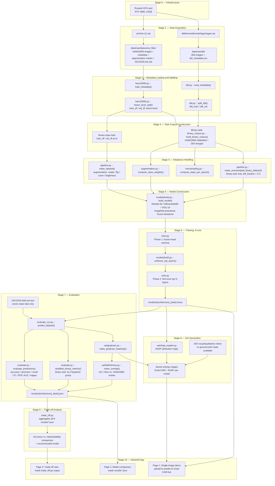

# Deep Learning for Multi-Class Skin Cancer Detection: A Performance and Interpretability Analysis

MSc dissertation project. Trains and compares three CNN architectures (ResNet-50,
EfficientNetB4, VGG-16) on two dermoscopic-image classification tasks, then evaluates
the trade-off between classification performance and post-hoc explainability
(Grad-CAM, SHAP). See `spec/specification.md` for the full WHAT/WHY/CONSTRAINTS form and
`project_desc.txt` for the original proposal.

> **This is a living document.** It is updated as the pipeline is built out, not
> written once and left. If a stage's status below is stale relative to `src/`, trust
> `src/` and fix this file.

## System overview

Two classification tasks share one data foundation (HAM10000) and diverge downstream:

- **Primary task — seven-class:** HAM10000 only (10,015 images / 7,470 unique lesions),
  split at the lesion level, evaluated on an internal validation split *and* the
  independent ISIC2018 Task 3 held-out test set (1,511 images).
- **Secondary task — binary malignant/benign:** HAM10000 (relabelled to malignant/benign)
  combined with the full DDI dataset (656 images), included specifically to bring in
  skin-tone diversity absent from HAM10000. Evaluated on the internal split, additionally
  stratified by Fitzpatrick skin-tone group.

Every architecture is trained once per task (3 architectures × 2 tasks = 6 trained
models), evaluated with the same metric suite, explained with Grad-CAM and SHAP, and
finally compared in a trade-off analysis to select the best accuracy/interpretability
balance. A Streamlit app surfaces the trained models and results interactively as the
project's demonstrable artefact.

Infrastructure: Runpod on-demand GPU (RTX 4090, 24GB), chosen for compute-bound CNN
transfer learning within a fixed deadline. This deviates from the proposal's original
"Kaggle GPU infrastructure" statement — see `docs/pipeline/00-infrastructure.md` and
flag the switch to your supervisor before submission.

## Pipeline diagram



## Pipeline stages

Each stage has its own doc under `docs/pipeline/` — purpose, inputs, process, outputs,
code references, and current status. Update the relevant stage doc (and the status
table below) whenever that stage's implementation changes.

| # | Stage | Status | Doc |
|---|---|---|---|
| 0 | Infrastructure | Decided (Runpod, RTX 4090) | [`docs/pipeline/00-infrastructure.md`](docs/pipeline/00-infrastructure.md) |
| 1 | Data acquisition | Manual step, not yet automated | [`docs/pipeline/01-data-acquisition.md`](docs/pipeline/01-data-acquisition.md) |
| 2 | Metadata loading & splitting | Implemented | [`docs/pipeline/02-metadata-loading-splitting.md`](docs/pipeline/02-metadata-loading-splitting.md) |
| 3 | Task corpus construction | Implemented | [`docs/pipeline/03-task-corpus-construction.md`](docs/pipeline/03-task-corpus-construction.md) |
| 4 | Imbalance handling | Implemented | [`docs/pipeline/04-imbalance-handling.md`](docs/pipeline/04-imbalance-handling.md) |
| 5 | Model construction | Implemented | [`docs/pipeline/05-model-construction.md`](docs/pipeline/05-model-construction.md) |
| 6 | Training | Implemented, not yet run on Runpod | [`docs/pipeline/06-training.md`](docs/pipeline/06-training.md) |
| 7 | Evaluation | Implemented, not yet run | [`docs/pipeline/07-evaluation.md`](docs/pipeline/07-evaluation.md) |
| 8 | XAI generation | Partially implemented (SHAP module exists; no saved-overlay step yet) | [`docs/pipeline/08-xai-generation.md`](docs/pipeline/08-xai-generation.md) |
| 9 | Trade-off analysis | Implemented, not yet run (depends on Stage 7 outputs) | [`docs/pipeline/09-trade-off-analysis.md`](docs/pipeline/09-trade-off-analysis.md) |
| 10 | Streamlit app | Planned — not yet built | [`docs/pipeline/10-streamlit-app.md`](docs/pipeline/10-streamlit-app.md) |

## Repository layout

```
src/
  config.py           # paths, class lists, label mappings, per-architecture settings
  data/                # Stages 1-4: loading, splitting, corpus construction, imbalance handling
  models/build.py      # Stage 5: model construction
  train.py             # Stage 6: training entrypoint
  evaluate.py           evaluate_run.py   # Stage 7: metrics + faithfulness
  xai/                 # Stages 7-8: Grad-CAM, SHAP, faithfulness scoring
  trade_off.py         # Stage 9: cross-model comparison
tests/                 # unit tests, one file per src/ module (pytest)
spec/
  specification.md     # WHAT/WHY/CONSTRAINTS/RISKS/ACCEPTANCE-CRITERIA
journal/
  agent-journal.md      # reflective log, evidence for dissertation Appendix A.4
docs/pipeline/          # this file's per-stage detail docs
```

## Related documents
- `project_desc.txt` — original project proposal text.
- `spec/specification.md` — governance-form specification derived from the proposal.
- `journal/agent-journal.md` — reflective account of decisions and uncertainty as the
  project was built (Appendix A.4 evidence).

## Data & licensing
- **HAM10000** — CC BY-NC 4.0, non-commercial academic use, attribution required.
- **DDI** — attribution to Stanford University required; exact licence terms not yet
  independently verified (confirm before submission — see `spec/specification.md`
  CONSTRAINTS).
- Neither dataset's raw files are committed to this repository (see `.gitignore`) —
  extract locally per `docs/pipeline/01-data-acquisition.md`.
