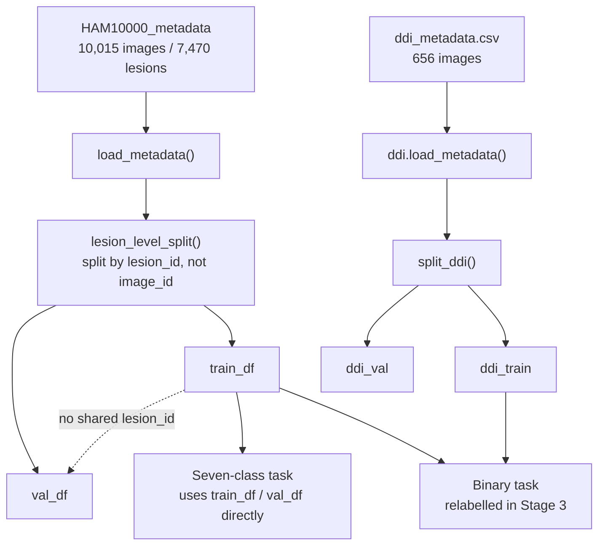

# Stage 2 — Metadata Loading & Splitting

**Status:** Implemented.

## Purpose
Load each dataset's metadata into a DataFrame and produce a train/validation split
that cannot leak information between the two — specifically, a single lesion (which
may have multiple photographs in HAM10000) must never appear in both the training and
validation sets.

## Inputs
- `data/raw/dataverse_files/HAM10000_metadata` (via Stage 1).
- `data/raw/ddi/ddi_metadata.csv` (via Stage 1).

## Process
1. `src/data/ham10000.py :: load_metadata()` reads `HAM10000_metadata` into a
   DataFrame (columns include `lesion_id`, `image_id`, `dx`, `dx_type`, `age`, `sex`,
   `localization`, `dataset`).
2. `src/data/ham10000.py :: lesion_level_split()` splits by **`lesion_id`**, not
   `image_id` — HAM10000's 10,015 images correspond to only 7,470 unique lesions
   (repeat photographs of the same lesion). An image-level split would let the same
   lesion appear in both train and validation, inflating reported performance.
3. `src/data/ddi.py :: load_metadata()` reads `ddi_metadata.csv` (columns: image path,
   `skin_tone` — grouped Fitzpatrick bands 12/34/56 — `malignant` boolean, `disease`).
4. `src/data/ddi.py :: split_ddi()` splits DDI into `ddi_train` / `ddi_val`.

**Important shared-split property:** `src/train.py :: prepare_data()` calls
`ham10000.lesion_level_split()` **once** and reuses the same `train_df`/`val_df` for
both the seven-class task and (after relabelling) the binary task. This means no
lesion appears in one task's training set and the other task's validation set — a
deliberate design choice, not an accident of code reuse.

## Diagram

## Outputs
- `train_df`, `val_df` — lesion-level HAM10000 split (used directly by the seven-class
  task, and as the HAM10000 half of the binary task after relabelling).
- `ddi_train`, `ddi_val` — DDI split (used only by the binary task).

## Code references
- `src/data/ham10000.py :: load_metadata()`, `lesion_level_split()`.
- `src/data/ddi.py :: load_metadata()`, `split_ddi()`.
- `src/train.py :: prepare_data()` (consumer; shows the shared-split property).

## Tests
- `tests/test_ham10000.py`, `tests/test_ddi.py`.

## Notes / open items
- The `RANDOM_SEED` used for splitting is fixed in `src/config.py` (`RANDOM_SEED = 42`)
  for reproducibility — keep this unchanged once real training runs begin, otherwise
  results across runs become non-comparable.
