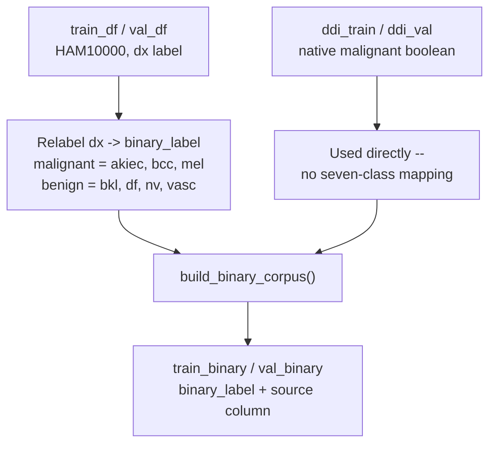

# Stage 3 — Task Corpus Construction

**Status:** Implemented.

## Purpose
Build the actual training/validation corpora for each of the two classification
tasks from the split DataFrames produced in Stage 2.

## Inputs
- `train_df`, `val_df` (HAM10000, lesion-level split, Stage 2).
- `ddi_train`, `ddi_val` (DDI split, Stage 2) — binary task only.

## Process

### Seven-class task
No further construction needed — `train_df`/`val_df` are used directly, with HAM10000's
native `dx` column (one of `SEVEN_CLASSES` in `src/config.py`) as the label.

### Binary task
`src/data/binary_corpus.py :: build_binary_corpus()`:
1. Relabels HAM10000 rows from their seven-class `dx` diagnosis to a binary
   `binary_label`, using the grouping fixed in `src/config.py`:
   - `MALIGNANT_CLASSES = {"akiec", "bcc", "mel"}`
   - `BENIGN_CLASSES = {"bkl", "df", "nv", "vasc"}`
2. Merges in the DDI rows, which already carry a native `malignant` boolean — used
   directly rather than re-derived, since DDI's 78 specific diagnoses do not map
   cleanly onto HAM10000's seven-class taxonomy (a substantial share — e.g.
   verruca-vulgaris, epidermal-cyst, acrochordon, neurofibroma, lipoma — have no
   reasonable seven-class counterpart). This is why DDI is used for the binary task
   only, never forced into the seven-class task.
3. Result is a combined corpus with a `source` column (`"ham10000"` or `"ddi"`) so
   downstream stages (imbalance handling, evaluation) can distinguish rows by origin.

## Diagram

## Outputs
- `train_binary`, `val_binary` — combined HAM10000+DDI corpora with a unified
  `binary_label` column and a `source` column.

## Code references
- `src/data/binary_corpus.py :: build_binary_corpus()`.
- `src/config.py :: MALIGNANT_CLASSES`, `BENIGN_CLASSES`.
- `src/train.py :: prepare_data()` (calls this for `task_name == "binary"`).

## Tests
- `tests/test_binary_corpus.py`.

## Notes / open items
- The `akiec`→malignant grouping is borderline in some published taxonomies
  (actinic keratosis is precancerous, not definitively malignant). This grouping was
  flagged in the agent journal (2026-07-31 entry) as needing supervisor confirmation
  before training — confirm before the binary-task numbers are treated as final.
