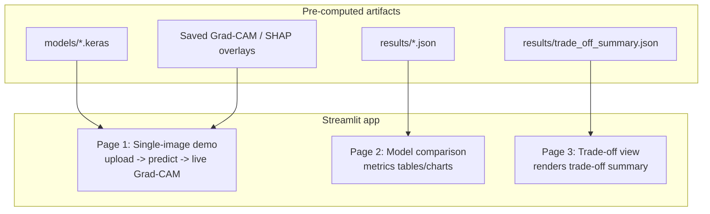

# Stage 10 — Streamlit App

**Status:** Planned — not yet built. No code exists under `src/` for this stage yet.

## Purpose
Interactive demonstrator that surfaces the trained models, their evaluation results,
and their XAI explanations, without requiring the examiner/reader to run training or
evaluation scripts themselves. Not part of the original proposal — an added artefact
to make the interpretability comparison (Objective 5) tangible; mention this addition
and its rationale explicitly in Chapter 3.

## Inputs (all pre-computed by earlier stages — this app does no training)
- `models/{architecture}_{task}.keras` (Stage 6) — for live Grad-CAM + prediction.
- `results/{architecture}_{task}.json` (Stage 7) — metrics tables.
- `results/trade_off_summary.json` (Stage 9) — trade-off comparison.
- Saved Grad-CAM/SHAP overlay images (Stage 8) — SHAP is too slow to compute live in
  an interactive app, so precomputed overlays are used for SHAP display; Grad-CAM can
  be computed live since it's cheap (single backward pass).

## Planned structure

### Page 1 — Single-image demo
- User uploads an image or picks a bundled sample.
- User selects architecture (ResNet-50 / EfficientNetB4 / VGG-16) and task
  (seven-class / binary).
- App loads the corresponding `.keras` model, runs prediction, shows class
  probabilities, and renders a **live** Grad-CAM overlay
  (`src/xai/gradcam.py :: make_gradcam_heatmap()` + `overlay_heatmap()`).
- SHAP overlay shown only for bundled sample images with a precomputed overlay from
  Stage 8 — not computed on user-uploaded images live.

### Page 2 — Model comparison
- Reads all 6 `results/{architecture}_{task}.json` files directly (no recomputation).
- Table/chart: accuracy, precision/recall/F1, ROC-AUC, Cohen's Kappa per architecture
  and task; ISIC2018 held-out results (seven-class); skin-tone-stratified results
  (binary, DDI rows only — see Stage 7 note on what that stratification does and does
  not cover).

### Page 3 — Trade-off view
- Reads `results/trade_off_summary.json` (Stage 9) directly.
- Renders the accuracy-vs-faithfulness comparison and the plain-text trade-off summary
  `src/trade_off.py` already produces — this page should not re-derive or re-word the
  trade-off conclusion, just display it, to avoid the app and the dissertation text
  drifting out of sync with each other.

## Diagram

## Practical constraint: model hosting
`models/*.keras` files are `.gitignore`d (likely several hundred MB each per
architecture) and are **not** in the GitHub repository. The app needs a way to access
them at runtime. Two options, not yet decided:
1. Run the Streamlit app on the same Runpod volume/pod where training happened (models
   already local — no transfer needed, but the app is only reachable while that pod is
   up).
2. Push trained models to external storage (e.g. a cloud bucket or Hugging Face Hub)
   and have the app download them on startup.

**Decide this before building Page 1** — it changes the app's model-loading code
directly. Once decided, document the choice here (with rationale, in the same
Decision → Options → Rationale → Consequences form used for Stage 0) so this stays
consistent with how the rest of the infrastructure was documented.

## Outputs
- A running Streamlit app (`app.py` or similar, not yet created), locally or deployed.

## Code references
- None yet — this stage has no implementation. First files to create:
  `app.py` (entrypoint), plus a `pages/` directory if using Streamlit's
  multi-page structure (`pages/1_single_image_demo.py`,
  `pages/2_model_comparison.py`, `pages/3_trade_off_view.py`).

## Notes / open items
- Add `streamlit` to `requirements.txt` once this stage starts (not currently listed).
- No tests exist yet for this stage — once built, prioritise testing the data-loading
  functions (reading `results/*.json`, locating model files) over UI rendering itself.
