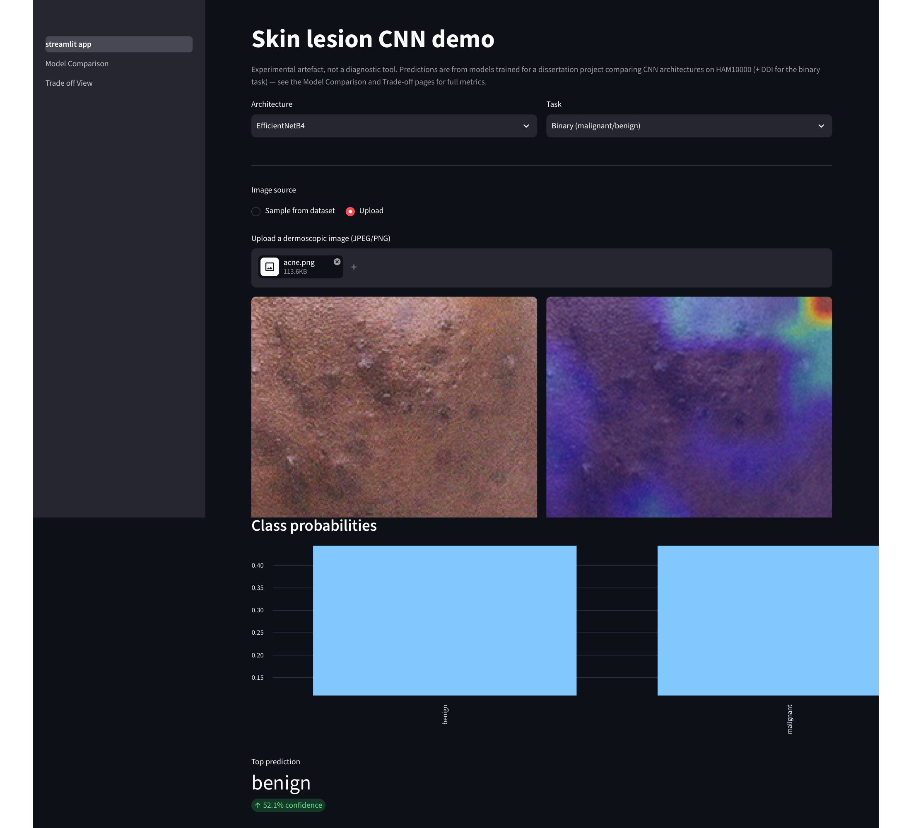
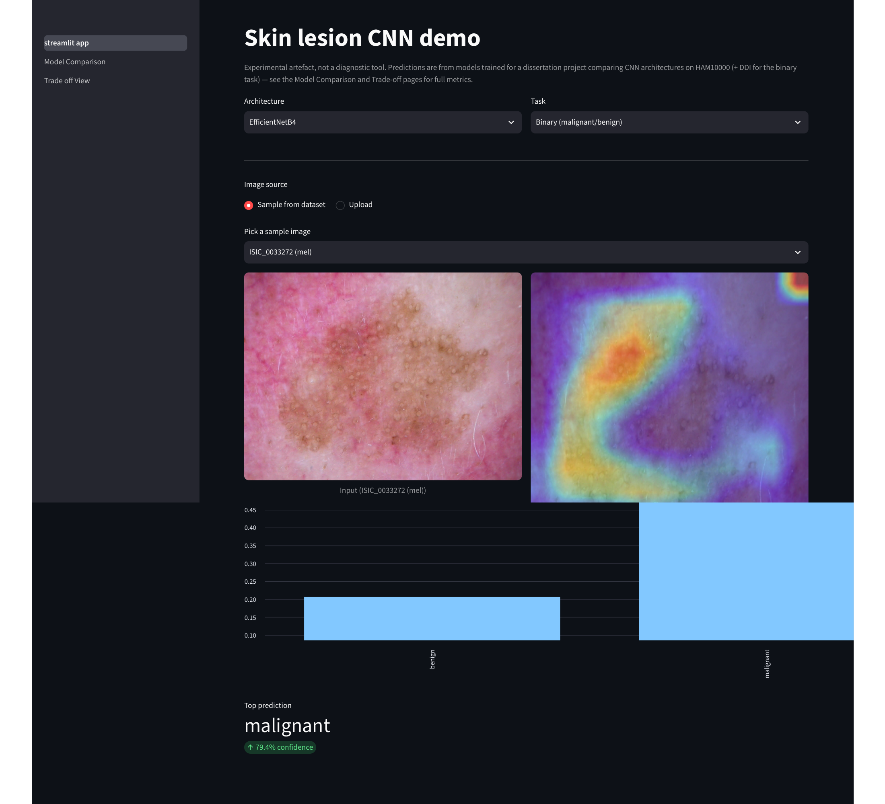

# Appendix A: Source Code and Data Availability

The source code, trained model checkpoints, and raw experimental results underlying this dissertation are submitted separately as the project Artefact, in line with the submission requirements set out in the handbook. They are not reproduced in full here; this appendix instead summarises how that material is organised, to support closer study or replication by a reader who has access to the Artefact.

The project is organised as a single repository containing a `data` directory holding the raw HAM10000 and DDI image sets and their accompanying metadata, a `scripts` directory holding the training and evaluation scripts used to produce every result reported in Chapters 3 and 4, a `models` directory holding the trained model checkpoints for all six architecture and task combinations, and a `results` directory holding the JSON-formatted evaluation outputs, per-epoch training histories, and Grad-CAM and SHAP faithfulness scores that this dissertation's tables and figures are drawn from directly.

HAM10000 is publicly available and is described in Tschandl, Rosendahl and Kittler (2018); DDI is publicly available and is described in Daneshjou et al. (2022). Both are cited in full in the References section. Neither dataset was modified beyond the preparation steps described in Chapter 3, and no new data was collected for this project.

# Appendix B: Streamlit Demonstrator Screenshots

Section 3.11 introduces the interactive Streamlit demonstrator built alongside the main experimental pipeline, added after the original proposal to make the interpretability comparison (Objective 5) tangible without requiring a reader to run the training or evaluation scripts directly. The two figures below show its single-image demo page in use, for the EfficientNetB4 binary model in both of its supported image-source modes.

**Figure B.1** shows the "Upload" mode, given a non-dermoscopic photograph of acne rather than a genuine dermoscopic lesion image, as an informal out-of-distribution check. The model's top prediction is benign, but at only 52.1% confidence — close to the decision boundary — which is the behaviour a well-calibrated model should show on an input unlike anything in its training distribution, rather than a confidently wrong answer. The Grad-CAM overlay correspondingly shows no coherent focus on a lesion-like structure, consistent with there being no lesion for it to attend to.

**Figure B.2** shows the "Sample from dataset" mode, using the bundled HAM10000 sample ISIC_0033272, a confirmed melanoma (`mel`). Here the model correctly predicts malignant at 79.4% confidence, and the Grad-CAM overlay concentrates on the pigmented lesion itself rather than the surrounding healthy skin — a qualitative example of the same faithfulness property quantified numerically in Chapter 4's IoU/Dice analysis.

These two cases were chosen to illustrate contrasting behaviour — an uncertain, appropriately-hedged prediction on an out-of-distribution input, and a confident, correctly-localised prediction on an in-distribution malignant case — rather than as a claim of general reliability; the quantitative evaluation in Chapter 4 remains the primary evidence for model performance.
