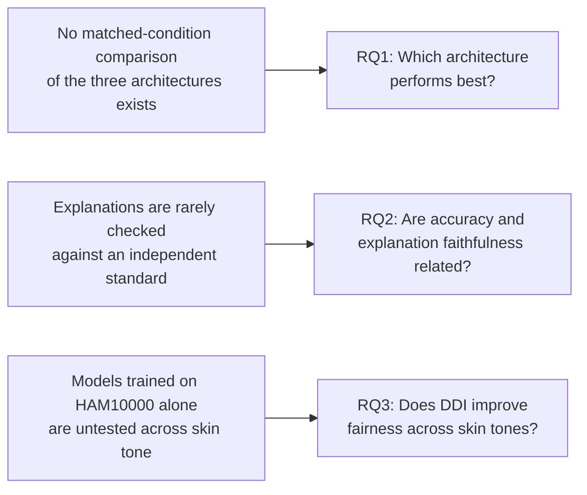

# Chapter 1: Introduction

## 1.1 Background and Context

Skin cancer is the most common form of human cancer, with an estimated 5.4 million new cases diagnosed annually in the United States alone (Esteva et al., 2017). Melanoma, its most dangerous form, illustrates why early detection matters so directly: the five-year survival rate exceeds 99% when the disease is caught at an early stage, but falls to approximately 14% when diagnosis is delayed until a late stage (Esteva et al., 2017). Dermoscopic imaging, combined with deep learning based image classification, has been proposed repeatedly in the literature as a way to support faster, more consistent screening, and convolutional neural networks in particular have been shown to reach or exceed dermatologist-level accuracy on narrowly scoped, binary classification tasks (Esteva et al., 2017; Haenssle et al., 2018).

That evidence, strong as it is, does not transfer automatically to the harder and more clinically realistic problem this dissertation addresses. A binary decision between two well-separated categories is a different task from classifying a lesion into one of seven diagnostic categories that share overlapping visual features. Nor does classification accuracy, however high, address a second concern that has grown alongside these models: convolutional neural networks are opaque by default, and a clinician cannot evaluate a prediction they cannot inspect. Explainable artificial intelligence methods such as Grad-CAM and SHAP have been proposed to open that opacity up, but the literature reviewed in Chapter 2 shows these methods are frequently applied and rarely checked against any independent standard. A third concern sits alongside both of these: the datasets these models are trained and evaluated on are not demographically representative, and a model's apparent accuracy can conceal how unevenly that accuracy is distributed across the patients it might one day be used on.

This dissertation was designed around these three concerns together, using skin cancer classification as the applied setting in which to investigate them, without treating the resulting models as a clinical tool.

## 1.2 Problem Statement

Five specific gaps motivate this study, each traceable to a limitation in the published literature reviewed in Chapter 2. First, no prior study was found that compares ResNet-50, EfficientNetB4, and VGG-16 under identical dataset and training conditions on the complete, unaltered seven-class HAM10000 distribution: existing comparisons either restrict the class taxonomy or remove images to force a more balanced dataset before training, so any reported difference between architectures is confounded with a difference in what each architecture was actually trained and tested on. Second, no prior study was found that combines a multi-architecture classification comparison with a quantitative, validated comparison of more than one explainability method, leaving open whether a model's most faithful explanation method is fixed or depends on the architecture producing it. Third, existing evaluation frameworks for this problem tend to rely on accuracy alone, or on accuracy paired with only one further metric, despite the class imbalance present in HAM10000 making that basis inadequate. Fourth, whether classification accuracy and explanation quality are related to one another has not been investigated across architectures. Fifth, the demographic generalisability of these models, specifically across Fitzpatrick skin type, has rarely been tested at all, since the datasets most commonly used, HAM10000 among them, are themselves skewed toward lighter skin tones.

## 1.3 Aim and Objectives

The aim of this project is to design and evaluate CNN-based classifiers for multi-class skin cancer detection from dermoscopic images, comparing three architectures on model choice, data preparation, training procedure, classification performance, demographic fairness, and post-hoc explainability, without producing or claiming a clinical diagnostic tool.

This aim is pursued through five objectives, following the project lifecycle from analysis through to a final trade-off judgement:

1. **Analysis.** Review the published literature on CNN-based multi-class image classification, transfer learning, techniques for handling class-imbalanced datasets, and explainable AI methods, to establish what is already known and where this study's contribution should sit.
2. **Design.** Design an experiment comparing ResNet-50, EfficientNetB4, and VGG-16 on a primary seven-class classification task using HAM10000, and a secondary binary malignant or benign classification task that incorporates the Diverse Dermatology Images dataset to widen the range of skin tones represented.
3. **Development.** Implement and train all three architectures on both tasks using transfer learning from ImageNet-pretrained weights, addressing HAM10000's class imbalance through augmentation and class weighting.
4. **Evaluation.** Evaluate and compare the six resulting models using accuracy, precision, recall, per-class F1 score, ROC-AUC, and Cohen's kappa, and assess the interpretability of each model's predictions using Grad-CAM and SHAP.
5. **Trade-off analysis.** Analyse the trade-off between classification accuracy and explainability across the three architectures, and identify which architecture, if any, offers the best balance of the two for this problem.

## 1.4 Research Questions

Three research questions follow directly from the objectives above and are answered in Chapters 4 and 5: which of the three CNN architectures performs best on multi-class dermoscopic image classification; whether classification accuracy and explanation faithfulness are related across architectures, or vary independently of one another; and whether incorporating the DDI dataset into the binary classification task produces more consistent accuracy across skin tones than a model trained on HAM10000 alone would achieve. Figure 1.1 shows how each question traces back to the concern that motivated it.

*Figure 1.1: How each research question traces back to the concern that motivated it.*

## 1.5 Significance of the Study

This project is explicitly an experimental, non-clinical study. Its significance lies in the methodological gaps it closes rather than in any diagnostic capability it produces. Evaluating all three architectures under identical, unaltered dataset conditions makes it possible to attribute a difference in performance to architecture rather than to how the dataset happened to be prepared for that particular study. Scoring Grad-CAM and SHAP quantitatively against ground-truth lesion masks, rather than presenting either as an unvalidated visualisation, responds directly to a weakness that a systematic review of the field found in the overwhelming majority of published work. Incorporating DDI as a dedicated fairness benchmark, evaluated through three separate training strategies rather than one, turns a stated concern about demographic bias into a measured, comparable result. None of this is offered as a solved problem: the discussion in Chapter 5 is explicit about what remains open even after these steps are taken.

## 1.6 Scope and Limitations

The scope of this project is bounded in ways stated here and revisited more fully in Chapter 5. The project produces no clinical tool and makes no clinical claim; every result is reported as an experimental finding only. Three architectures were compared, not an exhaustive survey of available CNN designs. Two explainability methods, Grad-CAM and SHAP, were carried through to the quantitative evaluation in Chapter 4; LIME, named alongside them in the original project proposal's literature-review objective, is not part of the empirical comparison, and its absence from that comparison should be read as a narrowing of scope during the project rather than an oversight. The quantitative faithfulness check is available only for HAM10000-derived predictions, since DDI provides no equivalent ground-truth segmentation mask; DDI-derived explanations were assessed visually only. Full detail on these and other limitations, including sample-size constraints and the single-seed nature of the training runs reported, is given in Chapter 5.

## 1.7 Structure of the Dissertation

The remainder of this dissertation is organised as follows. Chapter 2 reviews the published literature on CNN-based skin lesion classification and explainable AI, and identifies the five specific gaps this study is designed to address. Chapter 3 describes the methodology used to close those gaps: the datasets, the two classification tasks, the training procedure for all three architectures, the three-strategy DDI fairness comparison, the evaluation metrics, and the explainability and statistical verification methodology. Chapter 4 presents the results produced by applying that methodology, covering classification performance, the DDI fairness comparison, and the Grad-CAM and SHAP faithfulness results. Chapter 5 discusses those results against the literature reviewed in Chapter 2, states the study's limitations, draws conclusions, and sets out recommendations for future work.
