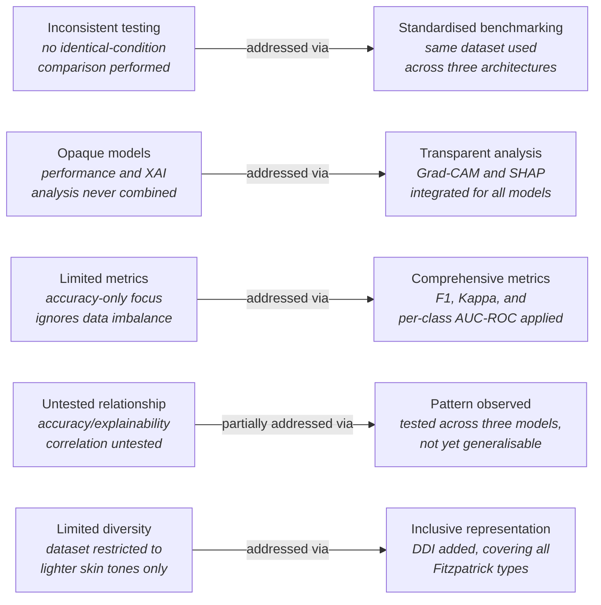
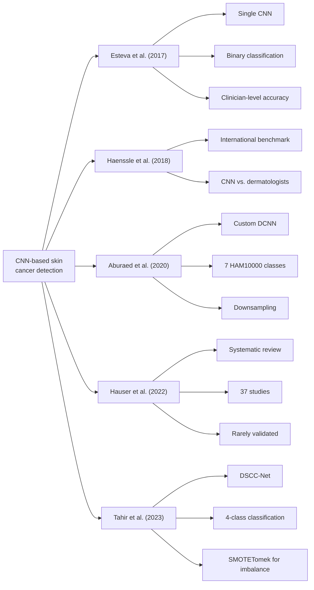

# Chapter 2: Literature Review

## 2.0 Overview

This chapter critically reviews the literature on skin cancer detection using deep learning methods, specifically CNNs, XAI, and multi-class dermoscopic image classification. It starts with definitions of the four terms central to this research. This is followed by a discussion of the main claims that emerge from the literature, thematically covering different CNN architectures, transfer learning techniques, methods to counter class imbalance, and various XAI techniques. The chapter then identifies the gaps in the literature that this study aims to fill and provides a review of five studies closely related to this one.

## 2.1 Definition of Key Terms

This section defines four terms central to the research, deep learning, skin cancer, convolutional neural network (CNN), and explainable artificial intelligence (XAI), using established definitions from the literature, and establishes the abbreviations CNN and XAI used throughout the research.

### 2.1.1 Deep Learning

Deep learning is a subfield of machine learning concerned with the training of artificial neural networks composed of multiple hierarchical layers, each of which learns progressively abstract representations of input data (Goodfellow, Bengio, and Courville, 2016). Unlike the traditional machine learning paradigm that depends on hand-designed feature extraction, deep learning algorithms automatically discover discriminative features from the input data in an iterative process of forward propagation, loss calculation, and backpropagation. The role deep learning plays in this research is that of a technical framework for automation in classifying skin lesions into multiple categories. Deep learning models used in this research, ResNet-50, EfficientNetB4, and VGG-16, are trained to automatically recognise visual features from dermoscopic images. These models classify images into one of the seven categories in the HAM10000 dataset as well as the DDI dataset. This is particularly crucial given the difficulty of intra-class variation in dermoscopy images.

### 2.1.2 Skin Cancer

Skin cancer is a malignant condition characterised by the uncontrolled proliferation of abnormal skin cells. It represents the most common form of human cancer, with an estimated 5.4 million new cases diagnosed annually in the United States alone (Esteva et al., 2017). It is broadly categorised into melanoma and non-melanoma variants, with melanoma being the most clinically dangerous due to its capacity for rapid metastasis if not detected early. Esteva et al. (2017) highlight the critical importance of timely detection, noting that the five-year survival rate for melanoma stands at over 99% when caught at an early stage but drops dramatically to approximately 14% when diagnosed at a late stage.

This study is motivated by the clinical imperative to improve early-stage skin cancer detection through automated image analysis, using the HAM10000 and DDI datasets.

### 2.1.3 Convolutional Neural Network (CNN)

A convolutional neural network (CNN) is a specialised class of deep neural network designed for processing structured grid data such as images. It uses locally connected layers, shared weights, and pooling operations to extract hierarchical spatial features (Goodfellow, Bengio, and Courville, 2016). Within this study, CNNs serve as the primary classification mechanism. Three established architectures, VGG-16, ResNet-50, and EfficientNetB4, are compared under controlled experimental conditions to assess their relative effectiveness for multi-class dermoscopic classification.

### 2.1.4 Explainable Artificial Intelligence (XAI)

Explainable artificial intelligence (XAI) refers to a set of methods and principles that enable the outputs and internal reasoning of artificial intelligence systems to be understood and interpreted by human users (Adadi and Berrada, 2018). As AI models such as deep neural networks have advanced, the decision process within these systems has also become more complex, leading to what is referred to as the black box problem.

In clinical settings, the opacity of deep learning models presents a significant barrier to adoption, since clinicians require not only accurate predictions but interpretable justifications that can be evaluated against established diagnostic reasoning (Hauser et al., 2022). These XAI methods, Gradient-weighted Class Activation Mapping (Grad-CAM) and SHapley Additive exPlanations (SHAP), are employed on the three CNN models after training, to examine whether a connection exists between accurate classification and clinically meaningful explanations.

## 2.2 Claims and Arguments

### 2.2.1 Claims from Literature

#### 2.2.1.1 CNNs Achieve Clinician-Level Diagnostic Accuracy

One of the central claims is that convolutional neural networks (CNNs) achieve an equal or even superior level of diagnostic accuracy compared to dermatologists. Esteva et al. (2017) reported that their deep convolutional neural network attained an AUC above 0.91 for both epidermal and melanocytic classifications, outperforming 21 board-certified dermatologists on biopsy-proven clinical images. For a nine-class classification task, they reported their CNN achieving an accuracy of 72.1%, against 65.56% for dermatologists assessing the same images. Esteva et al. (2017) also note the clinical relevance of such performance, since the five-year survival rate for melanoma is 99% with early detection but only 14% at late stages. Similarly, Haenssle et al. (2018) showed that a deep-learning CNN could outperform 58 dermatologists on dermoscopic melanoma recognition: in a two-class task, Level I dermatologists showed an average sensitivity of 86.6%, specificity of 71.3%, and ROC area of 0.79, while the CNN's ROC curve exceeded that of most clinicians. Liu et al. (2026) likewise note the significant advancements CNNs have achieved in diagnosing skin diseases. These sources together demonstrate the recurring claim that CNNs match or outperform dermatologists' diagnostic accuracy.

#### 2.2.1.2 Multi-Class Classification Is More Complex Than Binary Detection

The literature also claims that multi-class classification is substantially more complex than binary detection. Tahir et al. (2023) report multi-class accuracies on HAM10000 of 89.12% for VGG-16, 89.68% for ResNet-152, 89.46% for EfficientNet-B0, and 91.82% for Inception-V3, while their proposed DSCC-Net model reached 94.17% accuracy and 99.43% AUC. Aburaed et al. (2020) report accuracies of 96%, 94%, and 99% on a balanced HAM10000 dataset for VGG16, VGG19, and a custom DCNN respectively, noting that even minor architectural differences produce measurable variance in classification accuracy. Al Mahmud (2024) found that DenseNet201 outperforms both VGG16 and ResNet50 for multi-class skin lesion classification. Liu et al. (2026) identify intra-class variation and inter-class similarity as the main factors behind the difficulty of multi-class skin disease classification. Reported accuracies ranging from the high 80s to high 90s, depending on architecture and dataset preparation, support the claim that multi-class classification is significantly more sensitive to model design than binary detection.

#### 2.2.1.3 Class Imbalance in HAM10000 Distorts Standard Evaluation Metrics

Liu et al. (2026) state that class imbalance is one of the core issues in skin disease AI research. According to Daneshjou et al. (2022), HAM10000 also contains disproportionately many samples from Fitzpatrick skin types I to III, meaning that alongside class imbalance there is a problem of demographic representation. Aburaed et al. (2020) addressed this imbalance directly by removing approximately 5,000 NV samples before reporting their results. Codella et al. (2019) documented that the ISIC 2018 Challenge introduced balanced accuracy as its primary evaluation metric specifically to counteract this prevalence bias. Together, these sources establish that accuracy computed on HAM10000 is biased both by class imbalance and by demographic representation.

#### 2.2.1.4 XAI Methods Are Widely Applied but Rarely Clinically Validated

Hauser et al. (2022) systematically analysed 37 studies applying XAI methods to skin cancer detection. Of these, 19 conducted no evaluation of their XAI technique at all, while only three formally evaluated their XAI outputs through the work of clinicians. Hauser et al. (2022) also found Grad-CAM to be the most popular approach among the surveyed literature. Esteva et al. (2017) argue that interpretability matters for physicians' trust in automated diagnosis, making explainability a necessity for clinical practice rather than an optional feature. Liu et al. (2026) similarly state that explainability remains one of the open problems in clinical applications of skin disease AI. Together, these sources show that although widely used XAI methods such as Grad-CAM exist, they remain clinically unvalidated in most studies.

### 2.2.2 Critical Analysis and Arguments

#### 2.2.2.1 The Limits of Clinician-Level Accuracy Claims

While the claim that CNNs can achieve clinician-level diagnostic accuracy holds, it appears overstated once generalised to multi-class cases. Esteva et al. (2017) and Haenssle et al. (2018) demonstrate superior performance compared to dermatologists, but both studies were conducted on binary or limited-class problems, not on HAM10000's seven classes. This distinction matters, since multi-class classification introduces intra-class variance and inter-class similarity absent from the binary case, so accuracy figures from binary tasks should not be assumed to generalise. The experiments were also conducted on curated, controlled image sets, whereas Liu et al. (2026) observe that image noise and intra-class variation are poorly accounted for under such benchmark conditions. Notably, neither Esteva et al. (2017) nor Haenssle et al. (2018) included any explainability process in their evaluation, so accuracy alone is not sufficient to establish clinical trust. The claim that CNNs perform at clinician level is therefore undermined on three fronts: task difficulty, data realism, and interpretability. This study, in light of these limitations, tests CNN performance on the more difficult seven-class setting alongside an XAI analysis.

#### 2.2.2.2 The Absence of Consensus Across Multi-Class Architectures

Tahir et al. (2023) compare VGG-16, ResNet-152, EfficientNet-B0, and Inception-V3, but under dataset conditions different from those used by Aburaed et al. (2020), making direct comparison across the two studies impossible. This is compounded by the fact that Aburaed et al. (2020) achieved 99% accuracy only after removing approximately 5,000 NV samples from HAM10000, artificially inflating the result. Al Mahmud (2024) reports that DenseNet201 outperforms VGG16 and ResNet50, but does not compare DenseNet201 against EfficientNetB4, leaving that claim incomplete. Critically, no existing study compares ResNet-50, EfficientNetB4, and VGG-16 under identical dataset and training conditions on the full HAM10000 distribution. The present study fills this gap by holding dataset composition and training procedure constant across all three architectures, so that any performance difference can be attributed to architecture alone.

#### 2.2.2.3 Accuracy Metrics Without Per-Class Reporting Are Clinically Misleading

Although Codella et al. (2019) recognise that overall accuracy is inadequate under class imbalance, this recognition has not been consistently absorbed into later practice. Tahir et al. (2023) report AUC alongside accuracy, while Aburaed et al. (2020) report accuracy alone, showing the standard remains inconsistently applied. This is a serious problem: a model achieving 90% or higher overall accuracy while failing on melanoma (MEL) or basal cell carcinoma (BCC) would be harmful in a real-world setting, yet this kind of failure is hidden behind an overall accuracy figure. Daneshjou et al. (2022) further show that per-class accuracy can itself be misleading if models are not tested across Fitzpatrick skin types; notably, performance on Fitzpatrick types V to VI is absent from every reviewed paper relying solely on HAM10000. Liu et al. (2026) confirm that class imbalance remains an unsolved problem in the field. The use of Cohen's Kappa, per-class F1 scores, and cross-evaluation using the DDI dataset in the present study is therefore not a methodological enhancement but a necessary correction to a persistent evaluation deficiency in the reviewed literature.

#### 2.2.2.4 XAI Without Validation Is Not Explainability

Hauser et al. (2022) found that 19 of the 37 reviewed studies produced XAI visualisations without any evaluation; such studies cannot claim to have improved interpretability, since they generated an output without demonstrating that it aids clinical understanding. That only three of the 37 studies tested their XAI methods with clinicians represents a failure rate exceeding 90% at closing the interpretability-trust gap Esteva et al. (2017) identified as far back as 2017. The present study addresses this directly by applying and comparing both Grad-CAM and SHAP across three architectures, examining whether different architectures converge on clinically plausible regions of interest.

## 2.3 Gaps in Existing Literature

This study identifies five gaps, formulated not as observations but as direct consequences of the limitations described above.

The first gap is that no study tests ResNet-50, EfficientNetB4, and VGG-16 under the same experimental conditions using the whole HAM10000 dataset without modification. Tahir et al. (2023) test VGG-16 and EfficientNet-B0 alongside other architectures, but on only a four-class subset of HAM10000, and with some incorrectly annotated images. Aburaed et al. (2020) test all seven HAM10000 classes with VGG-16, but exclude 5,000 nevus samples to manipulate the dataset's class balance. In both studies, dataset and architecture vary simultaneously, making it impossible to attribute a performance difference to architecture choice alone. This gap is addressed here by testing three architectures under identical dataset conditions.

The second gap is that no study combines explainability analysis with classification performance analysis. Esteva et al. (2017) and Haenssle et al. (2018) reach clinician-level performance without providing any explanation of their models' reasoning, leaving performance figures as the only available evidence. Tahir et al. (2023) and Aburaed et al. (2020) similarly reach strong multi-class performance without any XAI analysis. Hauser et al. (2022), in their systematic review of 37 dermatology AI studies, found only three containing a formal XAI evaluation by dermatologists, and none of the reviewed studies compares SHAP and Grad-CAM in a multi-class setting across multiple CNN architectures. This gap is addressed here through XAI analysis applied to each architecture.

The third gap is that existing evaluation frameworks are inappropriate for an imbalanced dataset. Aburaed et al. (2020) report only overall accuracy, which Codella et al. (2019) show is insufficient to understand true algorithm performance on an imbalanced dataset. Tahir et al. (2023) report AUC alongside accuracy but omit F1 score and Cohen's Kappa, both of which more accurately reveal minority-class performance. Hauser et al. (2022) state that the lack of comprehensive multi-metric evaluation is a persistent problem in published skin-cancer AI research. This gap is addressed here through a comprehensive evaluation framework covering F1 score, Cohen's Kappa, per-class AUC-ROC, and the confusion matrix.

The fourth gap is that whether higher classification accuracy systematically implies higher explanation quality has never been investigated for ResNet, EfficientNet, and VGG architectures in a multi-class dermoscopy context. Hauser et al. (2022) note that the relationship between classification performance and explainability remains unresolved in the reviewed literature, with most studies treating the two concepts separately rather than exploring their interrelation.

The fifth gap is that demographic generalisability has not been explored in the reviewed studies. Esteva et al. (2017), Haenssle et al. (2018), Tahir et al. (2023), and Aburaed et al. (2020) all test their algorithms on datasets drawn mainly from lighter Fitzpatrick skin types, without testing on darker skin types. Daneshjou et al. (2022) identify this as a critical flaw and demonstrate it by testing several dermatology AI systems on the Diverse Dermatology Images (DDI) dataset of 656 images, covering the full Fitzpatrick I to VI range. The present study addresses this by adding DDI as a secondary evaluation benchmark alongside HAM10000.

These five gaps, and this study's corresponding contribution against each, are summarised in Figure 2.1.

*Figure 2.1: From literature gaps to this study's contribution.*

## 2.4 Related Work

A literature search was conducted through Google Scholar, FindIt (the university library's discovery search engine), and ResearchRabbit (a citation-network tool that surfaces related papers by citation network and semantic proximity to a seed article). The search keywords used were "skin cancer," "CNN," "HAM10000," "deep learning," and "artificial intelligence," constrained to the last ten years of publications so the literature reflects recent CNN architectures and evaluation methodology. Inclusion criteria required that articles use CNNs for classifying skin lesion or skin cancer images and report empirical performance results; systematic reviews were also included where they synthesise explainability methodologies applicable to this study.

The five papers analysed below were chosen for their relevance to this project's methodology: multi-class skin lesion classification via transfer learning with CNNs, use of HAM10000 as a baseline dataset, implementation of explainability methods (Grad-CAM, SHAP) in dermoscopic image classifiers, and the class imbalance problem in medical imaging datasets. Each analysis covers the paper's research setting, methodology, and results, followed by an assessment of its relevance and limitations with respect to the present study.

### 2.4.1 Esteva et al. (2017), Dermatologist-Level Classification of Skin Cancer with Deep Neural Networks

**Research setting.** Esteva et al. (2017) report a study by researchers from the Departments of Electrical Engineering, Dermatology, Pathology, and Computer Science at Stanford University, published in Nature in February 2017. It addresses skin cancer, the most common cancer type in the United States, responsible for approximately 5.4 million new cases annually. Melanoma's five-year survival rate drops from over 99% to about 14% depending on stage at diagnosis. Prior computational approaches relied on small datasets (fewer than 1,000 images) and hand-crafted features, limiting their generalisability relative to human clinicians.

**Methodology.** The authors fine-tuned an Inception v3 CNN, pretrained on 1.28 million ImageNet images, using a dermatological dataset of 129,450 clinical images spanning 2,032 diseases, together with a novel disease taxonomy and partitioning algorithm. This transfer-learning approach carried general visual features over to dermatological classification. The CNN was assessed on two binary tasks, keratinocyte carcinoma versus benign seborrheic keratosis, and malignant melanoma versus benign nevi, using biopsy-proven images and sensitivity-specificity analysis, with performance compared against at least 21 board-certified dermatologists.

**Findings.** The CNN achieved an area under the ROC curve (AUC) above 91% on both binary tasks, outperforming the majority of dermatologists, whose sensitivity-specificity points fell below the CNN's ROC curve. In a three-class classification task, the CNN achieved 72.1% accuracy, compared with 65.56% and 66.0% for two dermatologists assessing the same image set (Esteva et al., 2017).

**Relevance.** This study demonstrates that CNNs trained via transfer learning on ImageNet can perform at clinician level, supporting the transfer-learning approach used in this research. The clinical importance of early diagnosis for melanoma survival also supports the chosen research question.

**Limitations.** The study is limited to binary classification, unlike the seven-class classification addressed in the present research. Its 129,450-image training set is proprietary, making replication impossible. Critically, no explainability analysis accompanies the CNN's predictions: saliency maps appear only as supplementary material with no clinical evaluation. This interpretability gap is one of the issues this study addresses via Grad-CAM and SHAP.

### 2.4.2 Haenssle et al. (2018), Man Against Machine: Diagnostic Performance of a Deep Learning CNN vs. 58 Dermatologists

**Research setting.** Haenssle et al. (2018) report a cross-sectional reader study led by the Department of Dermatology, University of Heidelberg, with international contributions from Germany, the United States, and France, published in Annals of Oncology on 28 May 2018. The study was motivated by the absence of a direct comparison between CNNs and a large international cohort of dermatologists, despite Esteva et al. (2017) having already explored the question at a smaller scale.

**Methodology.** A modified Google Inception v4 CNN was trained and validated on dermoscopic images, then evaluated on a set of 100 images. Its performance was compared against 58 of 172 invited dermatologists (a 33.7% response rate) across a range of expertise levels, assessed under two conditions: Level I using dermoscopic images only, and Level II adding clinical information and close-up images.

**Findings.** The CNN outperformed dermatologists, achieving a mean ROC-AUC of 0.86 against 0.79 for dermatologists (p < 0.01). Model specificity reached 82.5%, against 71.3% for Level I dermatologists (p < 0.01). The CNN outperformed most dermatologists and approached the top three algorithms from the 2016 ISBI challenge.

**Relevance.** This benchmark adds further clinical evidence for CNN-based diagnosis and, together with Esteva et al. (2017), supports extending the clinical motivation from binary to the multi-class, seven-class HAM10000 classification problem addressed in this dissertation, with an added explainability dimension.

**Limitations.** Limitations include the narrow, binary scope of the problem, only a marginal performance gain from adding clinical information at Level II, no investigation of the CNN's internal decision-making process, use of a single architecture, and potential self-selection bias among the responding dermatologists.

### 2.4.3 Hauser et al. (2022), Explainable Artificial Intelligence in Skin Cancer Recognition: A Systematic Review

**Research setting.** Hauser et al. (2022) conduct a systematic review led by Hauser, Kurz, Haggenmuller, and more than thirty further contributors from the Digital Biomarkers for Oncology Group at the National Center for Tumor Diseases and the German Cancer Research Center in Heidelberg, with dermatology collaborators from Germany, France, and the United States. Published in the European Journal of Cancer in 2022 (accepted 24 February 2022), the study is motivated by the tension between CNNs' clinical-level precision and the trust barrier created by their black-box nature.

**Methodology.** Google Scholar, PubMed, IEEE Xplore, ScienceDirect, and Scopus were searched for peer-reviewed articles applying XAI to dermatological images between January 2017 and October 2021, yielding 37 qualifying articles.

**Findings.** Of these 37 articles, 19 applied an existing XAI technique without evaluation, four introduced a novel XAI technique, and 14 investigated narrower problems such as bias detection or educational use. Three studies assessed the clinical utility of XAI with dermatologists or dermatopathologists, and Grad-CAM and its variants were the most common method used.

**Relevance.** As the most directly relevant source on XAI in dermatology, this systematic review justifies this study's interpretability focus. Where the reviewed studies typically apply one XAI method to a single CNN, the present study applies two methods, Grad-CAM and SHAP, across three CNNs on HAM10000.

**Limitations.** The review's coverage ends in October 2021, excluding any subsequent XAI developments. Its meta-analysis of XAI quality is qualitative rather than quantitative. It is specific to skin cancer, with no generalisation to other imaging modalities, and includes no original experimental validation or HAM10000-specific study of its own.

### 2.4.4 Tahir et al. (2023), DSCC-Net: Multi-Classification Deep Learning Models for Diagnosing Skin Cancer Using Dermoscopic Images

**Research setting.** Tahir et al. (2023) report a study by researchers from the National College of Business Administration and Economics and the University of Management and Technology (Pakistan), together with Sejong University and the School of Medicine, Sungkyunkwan University (South Korea). Published in Cancers on 6 April 2023, it presents DSCC-Net, a novel deep learning architecture for multi-class skin cancer classification.

**Methodology.** DSCC-Net was evaluated on three public datasets, ISIC 2020, HAM10000, and DermIS, across four classes: melanoma, basal cell carcinoma, squamous cell carcinoma, and melanocytic nevi. Class imbalance was handled with SMOTETomek, and DSCC-Net was benchmarked against six baseline classifiers: ResNet-152, VGG-16, VGG-19, Inception-V3, EfficientNet-B0, and MobileNet.

**Findings.** DSCC-Net reached 94.17% accuracy, 99.43% AUC, 93.76% recall, 94.28% precision, and an F1-score of 93.93%, exceeding all baselines, notably VGG-16 (89.12%) and EfficientNet-B0 (89.46%).

**Relevance.** Tahir et al.'s (2023) benchmark figures for VGG-16 and EfficientNet-B0 on multi-class HAM10000 classification (89.12% and 89.46% respectively) provide the most directly comparable numbers for the architectures used in this dissertation. Their approach to class imbalance, SMOTETomek, is comparable to the class-weighted cross-entropy loss used here, making a direct methodological comparison one of this work's core contributions.

**Limitations.** DSCC-Net performs well but includes no XAI or interpretability analysis. This dissertation's comparison of ResNet-50, EfficientNetB4, and VGG-16 under identical experimental conditions, absent from Tahir et al.'s study, forms part of its contribution. Further limitations include the incomparability of a novel architecture against pretrained baselines, the use of only four of HAM10000's seven classes, and the absence of per-class AUC-ROC or Cohen's Kappa, which would allow proper evaluation of minority-class performance. The paper's abstract and Simple Summary also report slightly inconsistent baseline accuracies.

### 2.4.5 Aburaed et al. (2020), Deep Convolutional Neural Network (DCNN) for Skin Cancer Classification

**Research setting.** Aburaed et al. (2020) report a study by Aburaed, Panthakkan, Al-Saad, Amin, and Mansoor from the College of Engineering and IT, University of Dubai, presented at the 2020 27th IEEE International Conference on Electronics, Circuits and Systems (ICECS). The work addresses HAM10000's severe class imbalance, in which the nevus class makes up about 67% of the dataset.

**Methodology.** The researchers developed a custom deep convolutional neural network (DCNN), comprising three convolution-and-pooling blocks followed by dense layers and a softmax classifier, for classification across all seven HAM10000 classes, with VGG16 and VGG19 transfer-learning baselines included for comparison. Imbalance was handled by augmenting minority classes (cropping, scaling, contrast and brightness adjustment, flipping) and downsampling roughly 5,000 nevus images, producing a balanced dataset of 7,182 images (about 1,000 per class) with an 80/20 train/test split.

**Findings.** The custom DCNN reached 99% test accuracy, against 96% and 94% for VGG16 and VGG19 respectively.

**Relevance.** This is the most directly comparable prior study to the present one, since both use all seven HAM10000 classes and include VGG16 as a transfer-learning baseline. Where Aburaed et al. (2020) downsample the nevus class to balance the dataset, this study instead uses class-weighted cross-entropy loss, allowing a direct comparison of the two approaches.

**Limitations.** The study includes no XAI or interpretability analysis, and reports accuracy as its only metric, with no per-class F1, AUC-ROC, or Cohen's Kappa to reveal minority-class performance. Importantly, the reported 99% accuracy was achieved on the modified, balanced dataset, not on HAM10000 as released.

Having reviewed each paper individually, Figure 2.2 traces the chronological progression of these five studies from 2017 to 2023, showing the field's shift from single-architecture binary classification toward multi-class classification, with explainability only recently becoming a focus.

*Figure 2.2: Chronological evolution of the five reviewed studies, 2017 to 2023.*

## 2.5 Comparative Summary

Table 2.1 summarises the five reviewed studies side by side.

**Table 2.1: Comparative summary of the five reviewed studies**

| Study | Dataset | Architectures | Classes | XAI used? | Key finding |
|---|---|---|---|---|---|
| Esteva et al. (2017) | 129,450 images | Inception v3 | 2 to 3 | No | Clinician-level accuracy |
| Haenssle et al. (2018) | 100 test images | Inception v4 | 2 | No | Outperformed dermatologists |
| Aburaed et al. (2020) | HAM10000 (balanced) | Custom DCNN, VGG-16/19 | 7 | No | 99% accuracy |
| Hauser et al. (2022) | Systematic review | N/A | N/A | Yes | Systematic review of 37 studies |
| Tahir et al. (2023) | HAM10000 (4 classes) | DSCC-Net, VGG-16, etc. | 4 | No | 94.17% accuracy |

These five studies show a clear trend in classification complexity, from the binary tasks of Esteva et al. (2017) and Haenssle et al. (2018), through Tahir et al.'s (2023) four-class DSCC-Net, to Aburaed et al.'s (2020) seven-class HAM10000 classification. Yet four of the five studies pair their architecture with no explainability analysis at all; the only study that addresses XAI, Hauser et al. (2022), contributes no original empirical explainability results, only a review of existing literature. The accuracy figures above are also not directly comparable to one another, since they come from proprietary or curated binary datasets (Esteva et al., 2017; Haenssle et al., 2018) on one hand, and differently sized and differently balanced versions of HAM10000 (Tahir et al., 2023; Aburaed et al., 2020) on the other. This dissertation bridges both gaps by applying Grad-CAM and SHAP to compare three architectures on the unaltered, seven-class HAM10000 dataset.

## 2.6 Evolution of the Field

Machine-learning-based skin lesion classification was historically limited to algorithms using handcrafted features, manually constructed descriptors of texture, colour, border irregularity, and asymmetry, fed into classifiers such as support vector machines. Esteva et al. (2017) note that these systems' performance was constrained by small dataset sizes (fewer than 1,000 images) and by handcrafted features' inability to capture the full variety of dermoscopic appearances, limiting their ability to generalise beyond human dermatologists.

Deep learning brought a step change. Esteva et al. (2017) showed that a single convolutional neural network, trained on raw pixel values and disease labels via transfer learning from ImageNet (Goodfellow, Bengio, and Courville, 2016), could reach diagnostic accuracy comparable to board-certified dermatologists without any handcrafted feature extraction. Haenssle et al. (2018) extended this benchmark internationally, testing a CNN against 58 dermatologists and showing that deep learning can match or outperform human experts on binary classification tasks.

This success on binary tasks shifted the field's focus toward multi-class classification and architectural improvement. Tahir et al. (2023) and Aburaed et al. (2020) moved past early Inception-based models by comparing modern architectures, ResNet, VGG, EfficientNet, and custom DCNNs, on four- and seven-class skin cancer classification respectively, while addressing HAM10000's characteristic class imbalance. This era of multi-class classification also exposed problems in how model performance is evaluated: Codella et al. (2019) showed that accuracy alone cannot adequately describe algorithm performance on an imbalanced dataset, a point later echoed by subsequent authors working on multi-class skin lesion classification.

Explainability has only recently begun receiving comparable attention. As CNNs reached or surpassed clinician-level diagnostic accuracy, their opacity became the obstacle to trust (Adadi and Berrada, 2018). That only three of the 37 dermatology-AI studies reviewed by Hauser et al. (2022) clinically validated their generated explanations shows the field remains early and immature on this front. This dissertation sits at the intersection of all four of these developments: it applies modern architectures (ResNet-50, EfficientNetB4, VGG-16) to the full multi-class HAM10000 dataset, and evaluates their explainability through both Grad-CAM and SHAP.
