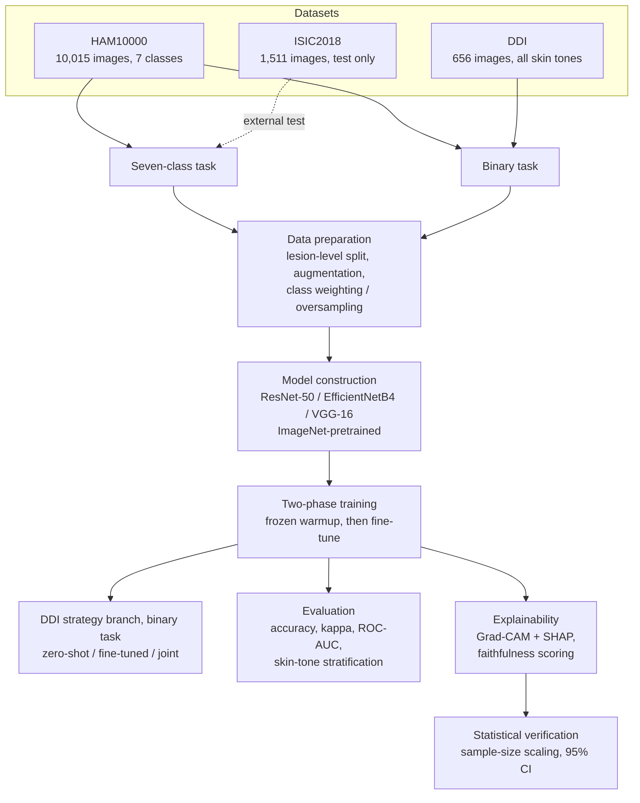
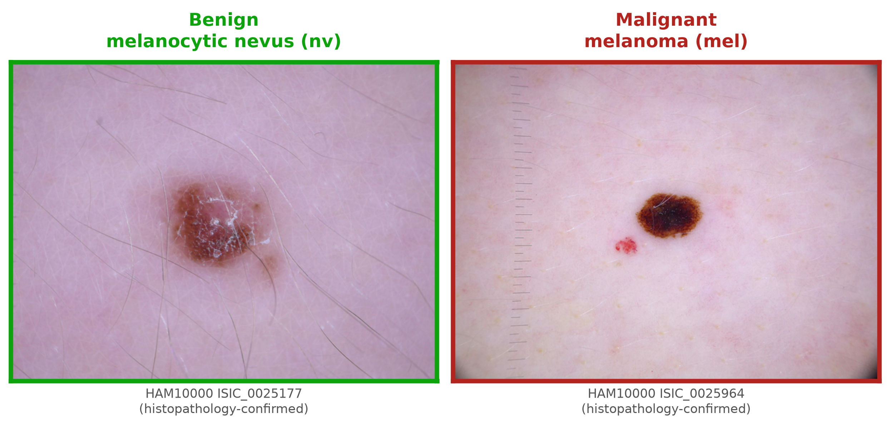
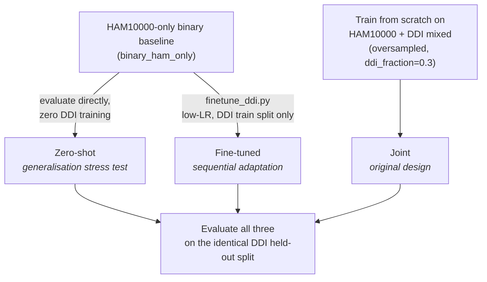
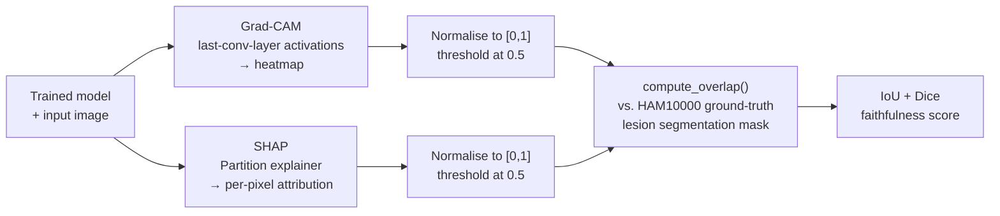
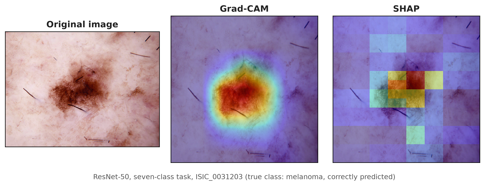
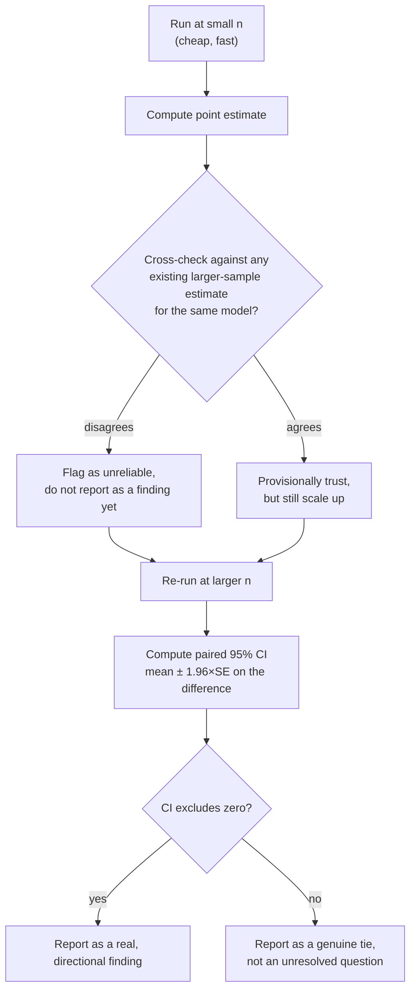

# Chapter 3: Methodology

## 3.1 Introduction

This chapter describes the methodology used to design, implement, and evaluate the three convolutional neural network architectures compared in this dissertation. It covers the datasets used, the two classification tasks defined for this study, the data preparation and training procedures applied to each architecture, the fairness evaluation methodology developed around the Diverse Dermatology Images (DDI) dataset, the metrics used to assess model performance, the explainability methods applied to each trained model, and the statistical approach taken to ensure that reported findings are supported by an adequate sample size rather than by chance. The chapter closes with a description of the computing infrastructure used to run the experiments.

The methodology was not fixed at the outset and left unchanged. Two points in particular required a revision of the original plan once early results were examined: the treatment of DDI's diagnostic taxonomy, and the design of the DDI fairness evaluation itself. Both revisions are described in the relevant sections below, together with the reasoning that produced them, since understanding why a method changed is as important to this dissertation as describing the method that was finally used.

The methodology described in this chapter was designed specifically to close the five gaps identified in the literature review. First, no prior study was found to compare ResNet-50, EfficientNetB4, and VGG-16 under identical dataset and training conditions on the complete, unaltered seven-class HAM10000 distribution; Tahir et al. (2023) evaluated a four-class subset, and Aburaed et al. (2020) removed approximately 5,000 nevus images before evaluation, so neither study can attribute a performance difference to architecture alone. Second, no prior study combined classification performance analysis with a quantitative comparison of Grad-CAM and SHAP across multiple architectures on a multi-class dermoscopy task. Third, prior evaluation frameworks were found to rely on accuracy alone, or on accuracy supplemented with only one further metric, despite Codella et al. (2019) and Hauser et al. (2022) both establishing that this is inadequate under the class imbalance present in HAM10000. Fourth, the relationship between classification accuracy and explanation quality across architectures had not been investigated. Fifth, demographic generalisability across Fitzpatrick skin type had not been tested in any of the reviewed studies that used HAM10000 alone. How the methodology responds to each of these five gaps is described in the sections that follow.

Figure 3.1 gives a single, simplified overview of the full methodology described in this chapter, from the three source datasets through to the statistical verification stage that closes it. Later sections expand each stage shown here in full detail.

*Figure 3.1: Simplified overview of the methodology, from datasets through statistical verification.*

## 3.2 Research Design

This project follows an experimental design. Three convolutional neural network architectures, ResNet-50, EfficientNetB4, and VGG-16, are each trained and evaluated on two classification tasks derived from dermoscopic skin lesion images. The first task is a seven-class classification of the diagnostic categories present in the HAM10000 dataset. The second task is a binary classification of lesions as malignant or benign, using a corpus that combines HAM10000 with the DDI dataset to broaden the range of skin tones represented in training and evaluation.

Each of the six resulting (architecture, task) combinations is evaluated using a consistent metric suite, so that the three architectures can be compared on a like-for-like basis. Two further layers of evaluation are then applied on top of this baseline. The first is a fairness evaluation, in which three different strategies for incorporating DDI into the binary task are compared against one another using DDI's held-out data. The second is an explainability evaluation, in which two post-hoc interpretability methods, Grad-CAM and SHAP, are applied to each trained model and scored for how well their explanations align with the ground-truth extent of the lesion in the image.

The project is explicitly non-clinical. No diagnostic tool is produced, and no claim is made that any of the models evaluated here are suitable for clinical decision-making.

## 3.3 Datasets

### 3.3.1 HAM10000

HAM10000 (Tschandl et al., 2018) is the primary dataset used in this study. It contains 10,015 dermoscopic images covering 7,470 unique lesions, since a number of lesions were photographed more than once. Each image is labelled with one of seven diagnostic categories: actinic keratosis and intraepithelial carcinoma (akiec), basal cell carcinoma (bcc), benign keratosis-like lesions (bkl), dermatofibroma (df), melanoma (mel), melanocytic nevi (nv), and vascular lesions (vasc). The dataset is heavily imbalanced: melanocytic nevi alone account for approximately 67 percent of all images (6,705 of 10,015), while dermatofibroma is the smallest class at 115 images.

HAM10000 also provides a ground-truth lesion segmentation mask for every image (Tschandl et al., 2018), released as a binary single-channel PNG matching the corresponding image's dimensions. These masks are not used during training. They are used exclusively in the explainability evaluation, where they serve as the ground truth against which Grad-CAM and SHAP attribution maps are scored.

HAM10000 is distributed under a Creative Commons Attribution-NonCommercial 4.0 licence, which restricts its use to non-commercial academic purposes with attribution. This restriction is compatible with the non-commercial, non-clinical scope of this project.

### 3.3.2 Diverse Dermatology Images (DDI)

The Diverse Dermatology Images dataset (Daneshjou et al., 2022) was added to the project after the original proposal was written, specifically to address a limitation of HAM10000: its images are drawn predominantly from lighter-skinned patients in Europe and Australia, and a model trained on HAM10000 alone offers no way to measure how it performs across a broader range of skin tones. DDI contains 656 images spanning 78 distinct diagnoses, each accompanied by a native malignant or benign label and a skin-tone annotation.

DDI's skin-tone field uses three grouped Fitzpatrick skin type bands rather than the full six-point Fitzpatrick scale: FST I to II, FST III to IV, and FST V to VI. The dataset is close to evenly distributed across these three bands (208, 241, and 207 images respectively), and across the malignant/benign label (171 malignant, 485 benign).

An early inspection of DDI's 78 diagnoses found that a substantial proportion, including verruca vulgaris, epidermal cyst, acrochordon, neurofibroma, lipoma, and molluscum contagiosum, have no reasonable equivalent among HAM10000's seven diagnostic classes. Rather than force an imprecise mapping onto the seven-class taxonomy, DDI's own native malignant/benign label was used directly, and DDI was incorporated only into the binary classification task. The reasoning behind this decision is discussed further below.

Use of DDI requires attribution to Stanford University. Its precise licence terms had not been independently verified at the time of writing this chapter and should be confirmed against DDI's official release documentation before any submission or redistribution of derived artefacts.

### 3.3.3 ISIC2018 Task 3 Held-Out Test Set

To provide an external check on the seven-class task that is independent of HAM10000's own train and validation split, the official ISIC2018 Task 3 held-out test set (Codella et al., 2019) was also used. This set contains 1,511 images that are lesion-disjoint from HAM10000's training data, and is used solely for evaluation, never for training.

### 3.3.4 Data Licensing and Ethical Compliance

Both datasets used in this project are pre-existing, publicly released, and already anonymised. No new data was collected, no patients were contacted, and no participants were recruited for this project. Handling of both datasets was assessed against UK GDPR and the Data Protection Act 2018, with no re-identification of any subject attempted at any point. The project falls under Light Touch Ethical Review, appropriate for a study that uses only existing, anonymised, publicly available data and produces no clinical tool. In line with University of South Wales policy, a Light Touch Ethical Review form for this project was completed in consultation with the project supervisor and submitted for approval in July 2026.

## 3.4 Task Formulation

### 3.4.1 Primary Task: Seven-Class Lesion Classification

The primary task classifies each HAM10000 image into one of the seven diagnostic categories described above. This task uses HAM10000 exclusively, split at the lesion level, and is evaluated both on an internal validation split and on the independent ISIC2018 test set.

### 3.4.2 Secondary Task: Binary Malignant/Benign Classification

The secondary task relabels HAM10000's seven diagnostic classes into a binary malignant or benign label, and combines the result with DDI's own native binary label to form a single, larger training corpus. The relabelling groups actinic keratosis, basal cell carcinoma, and melanoma as malignant, and benign keratosis-like lesions, dermatofibroma, melanocytic nevi, and vascular lesions as benign. This grouping treats actinic keratosis as malignant, a categorisation that some published work treats differently given its status as a precancerous rather than fully malignant lesion; this choice should be confirmed against supervisory guidance before the result is treated as final. Figure 3.2 shows one histopathology-confirmed example of each class from HAM10000, illustrating the kind of visual distinction the binary task asks each model to learn.

Because DDI's images and skin-tone labels are only used in this second task, only the binary task's results can speak to how well a model generalises across skin tone. The primary seven-class task is trained on HAM10000 alone and therefore retains HAM10000's original skin-tone skew in full.

### 3.4.3 Rationale for Two Separate Tasks

The decision to define two tasks, rather than one, follows directly from the taxonomy mismatch described above. Since a large share of DDI's 78 diagnoses cannot be mapped onto HAM10000's seven classes without introducing a substantial and unjustifiable labelling error, the alternative of folding DDI into a single seven-class corpus was rejected. Defining a second, binary task allows DDI to be used in full, under its own native and already-validated label, rather than under a forced relabelling that would compromise the seven-class task's label quality. Figure 3.1 above summarises how the three datasets described above feed into the two tasks just defined.

## 3.5 Data Preparation

### 3.5.1 Lesion-Level Train/Validation Splitting

HAM10000's 10,015 images correspond to only 7,470 unique lesions, since a number of lesions were imaged from more than one angle or at more than one time point. Splitting the dataset at the image level would risk placing two images of the same lesion on opposite sides of the train and validation split, which would let the model see a near-duplicate of a validation image during training and inflate the reported validation performance. To avoid this form of leakage, the split used throughout this project is performed at the lesion level: every image belonging to a given lesion is assigned entirely to either the training set or the validation set, never both.

### 3.5.2 Class Imbalance and Its Handling

Both tasks defined in this project involve substantial class imbalance. In the seven-class task, melanocytic nevi make up approximately 67 percent of HAM10000, while the smallest class, dermatofibroma, contains only 115 images. In the binary task, a second axis of imbalance is introduced by combining two datasets of very different size: DDI contributes 656 images against HAM10000's 10,015.

Two complementary strategies were used to address these imbalances, and both were chosen specifically to avoid discarding data. For the seven-class task, class weights were computed and applied during training so that errors on minority classes contribute proportionally more to the training loss than errors on the majority class. This differs from the approach taken by Aburaed et al. (2020), who removed approximately 5,000 nevus images from HAM10000 to force a balanced dataset before training, and from Tahir et al. (2023), who applied SMOTETomek resampling. Reducing the dataset in this way makes any reported accuracy figure specific to the modified dataset rather than to HAM10000 as released, which is one of the reasons the present study evaluates all three architectures on the complete, unaltered seven-class distribution instead. For the binary task's joint training strategy, an oversampled batching scheme was used instead: each training batch is constructed so that a fixed proportion of its images, 30 percent, is drawn from DDI, ensuring that DDI's comparatively small contribution to the combined corpus is not overwhelmed by HAM10000 in every batch despite the roughly fifteen-to-one difference in dataset size.

### 3.5.3 Data Augmentation

Standard image augmentation was applied during training to reduce overfitting and improve generalisation: random rotation, horizontal and vertical flipping, zoom, and brightness adjustment. The same augmentation pipeline was applied consistently across all three architectures and both tasks, so that any difference in results between architectures cannot be attributed to a difference in the data each one saw during training.

## 3.6 Model Architectures and Training

### 3.6.1 Choice of Architectures

Three convolutional neural network architectures were selected for comparison: ResNet-50 (He et al., 2016), EfficientNetB4 (Tan and Le, 2019), and VGG-16 (Simonyan and Zisserman, 2014). These three were chosen to span a range of design philosophies and computational cost: VGG-16 represents an earlier, comparatively simple stacked-convolution design; ResNet-50 introduces residual connections to allow effective training of deeper networks; and EfficientNetB4 applies a systematic compound scaling of depth, width, and input resolution. Table 3.1 summarises the input resolution and Grad-CAM target layer used for each architecture.

Two of these three architectures, VGG-16 and EfficientNetB4, have been evaluated on HAM10000 in prior work, but never under conditions that isolate the architecture itself as the source of any performance difference. Tahir et al. (2023) compared VGG-16 and EfficientNet-B0 alongside other architectures, but restricted their dataset to four classes rather than the full seven. Aburaed et al. (2020) evaluated VGG-16 across all seven classes, but first removed approximately 5,000 nevus images to force a more balanced dataset. In both cases, the dataset itself, not only the architecture, differs from one comparison to the next, so any reported difference in performance cannot be attributed to architecture alone. This study addresses that gap by training and evaluating all three architectures on an identical dataset, with an identical split, an identical augmentation pipeline, and an identical two-phase training procedure, so that any difference observed between architectures can be attributed to the architecture itself.

**Table 3.1: Architecture configuration summary**

| Architecture | Input resolution | Grad-CAM target layer |
|---|---|---|
| ResNet-50 | 224 x 224 | conv5_block3_out |
| EfficientNetB4 | 380 x 380 | top_activation |
| VGG-16 | 224 x 224 | block5_conv3 |

EfficientNetB4's canonical input resolution of 380 by 380 pixels is substantially larger than the 224 by 224 pixels used by the other two architectures. This difference in per-image memory footprint had a direct consequence for the explainability methodology described later in this chapter, where it limited the largest sample size that could be used when evaluating EfficientNetB4 with SHAP.

### 3.6.2 Transfer Learning Configuration

All three architectures were initialised with weights pretrained on ImageNet, and a new classification head appropriate to each task was attached in place of the original ImageNet output layer. This transfer learning approach was adopted rather than training each architecture from randomly initialised weights, on the standard basis that pretrained low-level and mid-level visual features transfer well to a new image domain and substantially reduce the amount of task-specific data required to reach good performance.

### 3.6.3 Two-Phase Training Procedure

Each of the six (architecture, task) combinations was trained using an identical two-phase procedure. In the first phase, the pretrained backbone was kept frozen and only the newly added classification head was trained. This warmup phase allows the head's initially random weights to reach a reasonable starting point before any gradient is allowed to flow back into the pretrained backbone, avoiding the risk that large, poorly calibrated early gradients would disturb the useful features the backbone already encodes. In the second phase, the top layers of the backbone were unfrozen and the whole network was fine-tuned together at a reduced learning rate, allowing the backbone's high-level features to adapt to the specific characteristics of dermoscopic images while its lower-level features, and the bulk of what it learned from ImageNet, remained largely intact.

## 3.7 Fairness Evaluation Methodology

### 3.7.1 Motivation for a Skin-Tone Fairness Test

Daneshjou et al. (2022), who introduced the DDI dataset, identified the absence of testing across darker Fitzpatrick skin types as a critical flaw in the dermatology AI literature, and demonstrated the point by evaluating several existing dermatology AI systems against DDI's full range of Fitzpatrick types I to VI. None of the other studies reviewed in the literature, including Esteva et al. (2017), Haenssle et al. (2018), Tahir et al. (2023), and Aburaed et al. (2020), tested their models on a dataset that included darker skin types at all. DDI was added to this project specifically to make it possible to measure, rather than only assume, how well a model trained primarily on HAM10000 generalises to patients with a wider range of skin tones than HAM10000 itself represents, following the same logic Daneshjou et al. (2022) applied. The original design incorporated DDI into the binary task's training data from the outset, mixed together with HAM10000. On reflection, this single design choice could not answer a question that matters directly to the fairness claim being investigated: how biased is a model that has never been exposed to DDI at all. A model trained jointly on both datasets has no HAM10000-only counterpart against which to measure that gap. The methodology was therefore revised to compare three distinct strategies for incorporating DDI, described below, rather than relying on one. Figure 3.3 outlines all three.

*Figure 3.3: The three DDI incorporation strategies compared in this study.*

### 3.7.2 Zero-Shot Generalisation Strategy

The first strategy trains a binary classifier on HAM10000 alone, then evaluates that model on the whole of DDI's 656 images without any further training on DDI at all. This strategy is a direct stress test of generalisation: since the model has never seen a DDI image or a DDI skin tone during training, its performance on DDI reflects only what it learned from HAM10000 and how well that transfers.

### 3.7.3 Sequential Fine-Tuning Strategy

The second strategy takes the same HAM10000-only baseline used in the zero-shot strategy and fine-tunes it further, at a low learning rate, on DDI's own training split. Its performance is then measured on DDI's held-out validation split, together with a check of how much of its original HAM10000 validation performance is retained after this additional fine-tuning step.

### 3.7.4 Joint Training Strategy

The third strategy is the project's original design: HAM10000 and DDI are combined into a single training corpus from the very first training batch, using the same oversampled batching scheme described above to prevent DDI's smaller size from being overwhelmed by HAM10000's much larger contribution. Its performance is measured on the same DDI held-out validation split used to evaluate the fine-tuning strategy, so that all three strategies can be compared on identical data.

### 3.7.5 Comparative Evaluation Across Strategies

All three strategies were evaluated on the same held-out portion of DDI, using the metric suite described above, with particular attention to Cohen's kappa. Kappa was treated as the decisive metric for this comparison, in preference to raw accuracy, because DDI's benign class forms the majority of its labels, and a model that defaults toward predicting benign for most inputs can achieve a misleadingly high accuracy without having learned to discriminate the malignant class at all. Kappa corrects for this by measuring agreement beyond what chance alone would produce.

## 3.8 Performance Evaluation Metrics

### 3.8.1 Core Classification Metrics

Every trained model, across both tasks, was evaluated using an identical core metric suite: overall accuracy, per-class precision, per-class recall, per-class F1 score, area under the receiver operating characteristic curve, Cohen's kappa, and the full confusion matrix. Applying the same metric suite to every (architecture, task) combination ensures that comparisons between architectures are made on a consistent basis throughout the dissertation.

This full suite was adopted specifically because accuracy alone is known to be inadequate on an imbalanced dataset such as HAM10000. Codella et al. (2019) introduced balanced accuracy as the primary metric for the ISIC2018 challenge for this reason, and Hauser et al. (2022) identified inconsistent, often accuracy-only, metric reporting as a recurring weakness across the dermatology AI literature. Aburaed et al. (2020) reported accuracy as the sole metric for their study, and Tahir et al. (2023) supplemented accuracy with area under the ROC curve but not with per-class F1 or Cohen's kappa. Reporting the full suite here, rather than accuracy alone or accuracy paired with a single further metric, is intended as a direct response to this weakness, not as an incidental addition to the evaluation.

### 3.8.2 External Validation on ISIC2018

For the seven-class task only, each model's performance was additionally measured on the independent ISIC2018 Task 3 held-out test set introduced earlier. Because this test set is lesion-disjoint from HAM10000's training data, agreement between a model's internal validation performance and its ISIC2018 performance provides evidence that the internal validation split has not been overfit to.

### 3.8.3 Skin-Tone-Stratified Evaluation

For the binary task, in addition to the core metrics above, performance was further broken down by DDI's three Fitzpatrick skin-tone bands (FST I to II, FST III to IV, and FST V to VI). This stratified evaluation is the mechanism by which the fairness question motivating DDI's inclusion is actually measured rather than left as a qualitative claim.

## 3.9 Explainability Methodology

Hauser et al. (2022), in a systematic review of 37 studies applying XAI methods to dermatological images, found that 19 of those studies applied a method such as Grad-CAM and produced a visualisation without evaluating it in any way, and that only 3 of the 37 formally validated their explanations against an independent standard. Grad-CAM was also found to be the most commonly used method in the reviewed literature, but its use was rarely accompanied by any check of whether the regions it highlighted were actually correct. The explainability methodology in this study was designed with that finding directly in mind: producing an explanation is treated here as only the first step, not the final one, and every explanation produced is scored against an independent ground truth rather than left as an unvalidated visualisation. No prior study identified in the literature compares Grad-CAM and SHAP against one another across more than one CNN architecture on a multi-class dermoscopy task, and the methodology below was designed to close that gap directly. Figure 3.4 outlines how both methods are produced and scored.

*Figure 3.4: How Grad-CAM and SHAP explanations are produced and scored against ground truth.*

### 3.9.1 Grad-CAM

Grad-CAM (Selvaraju et al., 2017) was applied to every trained model as the first of two post-hoc explainability methods used in this project. Grad-CAM produces a coarse localisation heatmap by using the gradients flowing into the final convolutional layer of the network to weight that layer's activation maps, highlighting the regions of an input image that most influenced the model's prediction. The specific target layer used for each architecture is given in Table 3.1.

### 3.9.2 SHAP

SHAP (Lundberg and Lee, 2017), applied here using its Partition explainer for image data, was used as the second explainability method. SHAP estimates a per-pixel attribution value for each prediction, grounded in Shapley values from cooperative game theory, by measuring how a model's output changes as coalitions of image regions are masked and unmasked. Unlike Grad-CAM, SHAP treats the underlying model as a black box and does not require access to its internal gradients or layer structure, at a substantially higher computational cost per image.

The two methods produce visibly different kinds of output. Figure 3.5 shows both applied to the same correctly classified melanoma image from ResNet-50: Grad-CAM produces a smooth, continuous heatmap centred on the lesion, while SHAP's Partition explainer produces a coarser, block-structured attribution map, a direct consequence of its superpixel-based masking approach rather than a sign that either method has failed.

### 3.9.3 Quantitative Faithfulness Scoring (IoU and Dice)

Rather than relying on visual inspection alone, both methods' output maps were scored quantitatively against a ground truth. Each map, whether produced by Grad-CAM or SHAP, was normalised to the range zero to one and thresholded at 0.5 to produce a binary attention region. This binary region was then compared against the ground-truth lesion segmentation mask supplied with HAM10000 using two overlap measures: Intersection over Union and the Dice coefficient. Because both methods' maps are normalised and thresholded in an identical way before this comparison, a difference in the resulting score reflects a genuine difference in how well each method localises the lesion, rather than an artefact of inconsistent preprocessing.

This quantitative faithfulness check could only be performed for HAM10000-derived predictions, since DDI provides no equivalent ground-truth segmentation mask. Any explanation produced for a DDI-derived prediction was therefore assessed visually only, and this distinction is maintained explicitly throughout the dissertation rather than left implicit.

## 3.10 Statistical Verification Approach

Figure 3.6 outlines the general verification cycle applied wherever a faithfulness estimate was computed in this study: a small sample is never trusted on its own, and is scaled up and checked with a formal interval estimate before being treated as a finding.

*Figure 3.6: The small-sample-first, verify-at-scale cycle applied throughout the explainability evaluation.*

### 3.10.1 Sample-Size Sensitivity in Faithfulness Estimates

An early finding shaped the remainder of this project's explainability methodology. Grad-CAM's faithfulness scores were initially computed on a sample of 30 images per model. When this sample size was increased to 150 images, several of the reported scores changed substantially; the binary task's ResNet-50 model, for example, moved from a mean IoU of 0.215 at 30 images to 0.157 at 150 images, a change of 27 percent. This demonstrated that a faithfulness estimate computed on a small sample could not be trusted at face value, and that any comparison built on such an estimate risked drawing a conclusion from noise rather than from a genuine difference between methods or architectures.

This lesson was applied directly to the comparison between Grad-CAM and SHAP. An initial comparison at 15 images per architecture suggested that which method was more faithful varied by architecture: Grad-CAM appeared more faithful for ResNet-50, while SHAP appeared more faithful for EfficientNetB4 and, more narrowly, for VGG-16. Given the sample-size sensitivity already observed for Grad-CAM alone, this comparison was judged not yet reliable enough to report as a finding, and was scaled up in stages, first to 150 images per architecture and subsequently to the largest sample size each architecture's memory constraints would allow (500 images for ResNet-50 and VGG-16; 400 images for EfficientNetB4, whose larger input resolution reduced the maximum feasible sample size).

### 3.10.2 Confidence Interval Estimation for Method Comparison

At each sample size, the difference between Grad-CAM's and SHAP's IoU score was computed for every image individually, producing a paired sample of per-image differences. The mean of this paired difference, together with its standard deviation, was then used to compute a standard error and a 95 percent confidence interval on the mean difference, using the normal approximation appropriate for a sample of this size. A confidence interval that excludes zero was treated as evidence of a genuine, directional difference between the two methods for that architecture. A confidence interval that includes zero was treated as evidence that the two methods are statistically indistinguishable for that architecture at the sample size tested, rather than as an unresolved question requiring an even larger sample.

Applying this procedure at the final sample sizes showed that the apparent EfficientNetB4 result from the initial 15-image comparison did not hold: at every larger sample size tested, the confidence interval on the Grad-CAM to SHAP difference included zero, indicating a genuine tie rather than a small-sample artefact that a larger sample would eventually resolve one way or the other. The ResNet-50 and VGG-16 results, by contrast, held and, in the case of VGG-16, strengthened as the sample size increased, with confidence intervals that excluded zero at every sample size from 150 images onward.

### 3.10.3 Bootstrap Confidence Intervals, Threshold Calibration, and Paired Significance Testing

The same verify-at-scale principle behind Sections 3.10.1 and 3.10.2 was applied to the classification and DDI strategy comparisons reported in Chapter 4, using three further, complementary statistical checks rather than treating either comparison's point estimates as settled on their own.

First, a percentile bootstrap, 2,000 resamples with replacement, was computed on the seven-class validation accuracy and kappa for each architecture, and separately on the joint binary model's DDI held-out kappa for each architecture, producing a 95 percent confidence interval around each point estimate. An interval that overlaps another architecture's interval was treated as evidence the two cannot be statistically distinguished at the sample size available, rather than as an inconclusive result requiring a different test.

Second, since every result reported in Sections 3.7 to 3.8 used the standard 0.5 decision threshold, each DDI strategy's predicted probabilities on the DDI held-out split were additionally swept across thresholds from 0.05 to 0.95 in steps of 0.05, and the threshold maximising kappa was recorded for each (architecture, strategy) combination. This checks whether a comparison between strategies is being made fairly, since two models can have a genuinely different discrimination ability even when their default-threshold kappa looks similar, or vice versa.

Third, because all three DDI strategies for a given architecture are evaluated on the identical DDI held-out images, a paired test has more statistical power than an independent-samples bootstrap comparison to detect a genuine difference between them. McNemar's exact binomial test, appropriate at any discordant-pair count rather than only the larger counts the chi-square approximation requires, was applied to each pairwise strategy comparison's correctness at the default threshold, for every architecture.

## 3.11 Experimental Infrastructure

Model training and the explainability experiments described above were run on an on-demand cloud GPU pod (Runpod), equipped with a single NVIDIA RTX 4090 GPU with 24 gigabytes of video memory. This departs from the original project proposal, which specified Kaggle's GPU infrastructure; the change was made for practical reasons related to session length and control over the runtime environment, and is recorded here as a deliberate deviation from the original plan.

One infrastructure-level constraint materially affected the SHAP sample-size methodology described above. The compute environment enforced a container memory limit of approximately 57 gigabytes, distinct from and substantially lower than the host machine's total available memory. Because EfficientNetB4's larger 380 by 380 input resolution increases the memory required to hold a batch of SHAP attribution values in memory simultaneously, attempting to run the SHAP faithfulness evaluation for EfficientNetB4 at the same 500-image sample size used for the other two architectures exceeded this limit and terminated the process before it could complete. EfficientNetB4's SHAP evaluation was consequently run at a maximum of 400 images rather than 500, a difference that is noted wherever EfficientNetB4's results are reported in this dissertation, so that the reader is not left to assume all three architectures were evaluated at an identical sample size.

Beyond the analyses above, the project also includes an interactive demonstrator built with Streamlit, added after the original proposal to make the interpretability comparison (Objective 5) tangible to a reader without requiring them to run the training or evaluation scripts themselves. The app loads each trained model checkpoint directly, accepts either an uploaded dermoscopic image or a bundled sample from the dataset, and renders a live Grad-CAM overlay alongside the model's class probabilities; separate pages expose the Chapter 4 metrics tables and the skin-tone-stratified DDI results directly from the underlying result files, so a reader can inspect the same evaluation outputs reported in this dissertation interactively. Example screenshots of the single-image demo page are given in Appendix B.

## 3.12 Chapter Summary

This chapter has described the datasets, task formulations, data preparation procedures, model architectures, training configuration, fairness evaluation methodology, performance metrics, explainability methods, and statistical verification approach used throughout this dissertation. Two methodological revisions were made in response to early findings rather than fixed at the outset: DDI's inclusion was restricted to a second, binary task once its taxonomy was found incompatible with HAM10000's seven classes, and the DDI fairness evaluation was expanded from a single joint-training design into a comparison of three distinct strategies once it became clear that a joint-trained model alone could not measure the generalisation gap the project set out to investigate. The results produced by applying this methodology are presented in Chapter 4.
