# Chapter 4: Results

## 4.1 Introduction

This chapter presents the results produced by applying the methodology described in Chapter 3. Results are reported in the same order the methodology introduced them: classification performance for all three architectures on both tasks, with a bootstrap check on how confidently the seven-class ranking can be stated; the comparison of the three DDI incorporation strategies, together with four further robustness checks on that comparison and the architecture ranking it implies, threshold calibration, a paired significance test, a multi-seed check, and a bootstrap confidence interval; the sample-size correction observed in the Grad-CAM faithfulness scores; and the comparison between Grad-CAM and SHAP faithfulness at increasing sample sizes, concluding with the paired confidence interval analysis that settles which architecture favours which explainability method. Interpretation of these results against the claims and gaps identified in the literature review is left to Chapter 5. This chapter reports what was found.

## 4.2 Classification Performance

### 4.2.1 Seven-Class Classification Results

Table 4.1 reports each architecture's performance on the primary seven-class task, on both the internal HAM10000 validation split and the independent ISIC2018 test set.

**Table 4.1: Seven-class classification performance**

| Architecture | Validation accuracy | Validation kappa | Validation ROC-AUC | ISIC2018 test accuracy |
|---|---|---|---|---|
| ResNet-50 | 65.8% | 0.470 | 0.935 | 65.7% |
| EfficientNetB4 | 63.0% | 0.431 | 0.913 | 61.4% |
| VGG-16 | 64.0% | 0.447 | 0.931 | 66.3% |

ResNet-50 achieved the highest validation accuracy and kappa among the three architectures, though the margin over VGG-16 is small (1.8 percentage points on accuracy, 0.023 on kappa). VGG-16 achieved the highest accuracy on the independent ISIC2018 test set, ahead of ResNet-50 by 0.6 percentage points and EfficientNetB4 by 4.9 percentage points. EfficientNetB4 recorded the lowest score on every metric in this table.

A percentile bootstrap (2,000 resamples) on each architecture's seven-class validation accuracy and kappa was computed to check how much confidence this ranking should be given. Table 4.1b reports the result.

**Table 4.1b: Bootstrap 95% confidence intervals, seven-class validation accuracy and kappa (n = 1,490)**

| Architecture | Accuracy | 95% CI (accuracy) | Kappa | 95% CI (kappa) |
|---|---|---|---|---|
| ResNet-50 | 65.8% | 63.4% to 68.1% | 0.470 | 0.437 to 0.503 |
| VGG-16 | 64.0% | 61.5% to 66.5% | 0.447 | 0.412 to 0.479 |
| EfficientNetB4 | 63.0% | 60.5% to 65.3% | 0.431 | 0.399 to 0.465 |

All three architectures' confidence intervals overlap substantially, on both accuracy and kappa. ResNet-50's point estimate leads on both metrics, as reported above, but its interval overlaps both VGG-16's and EfficientNetB4's in full, and VGG-16's and EfficientNetB4's intervals overlap each other too. Table 4.1's ranking should therefore be read as the best point estimate available from this single validation run, not as a statistically confirmed ordering: at 1,490 validation images, the seven-class task is not large enough for the observed differences between architectures to clear the bar of non-overlapping confidence intervals. This qualifies every subsequent reference in this dissertation to ResNet-50 "leading" or "achieving the highest" seven-class performance; the point estimate is real and is the best available estimate, but it is not a claim that a different validation sample could not have shown a different architecture ahead.

For all three architectures, ISIC2018 test accuracy tracked internal validation accuracy closely, within 2.4 percentage points in every case (ResNet-50 differed by 0.1 points, EfficientNetB4 by 1.6 points, and VGG-16, the largest gap, by 2.4 points). This close agreement between an internal split and a fully independent, lesion-disjoint test set indicates that none of the three models had been overfit to the internal validation split. Figure 4.1 presents the same comparison graphically.

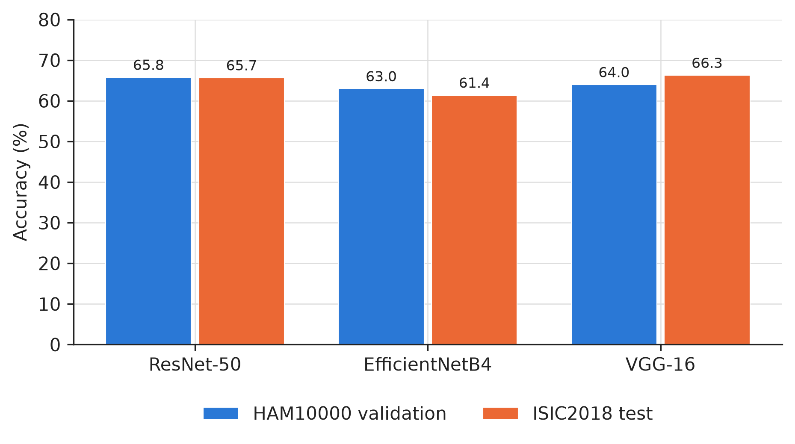

Figure 4.2 shows the full seven-class confusion matrix for each architecture, row-normalised so each cell reads as the percentage of a true class predicted as each possible class. All three architectures show the same characteristic pattern: strong performance on nv, the majority class, and substantial confusion between mel, bkl, and nv specifically, three classes whose dermoscopic appearance overlaps considerably. This is the single largest source of seven-class error for every architecture.

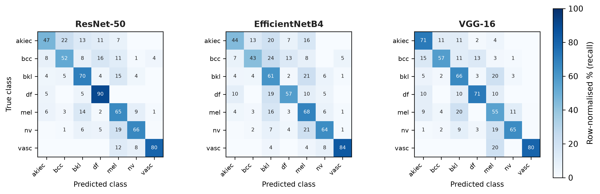

Figure 4.3 shows each architecture's training and validation accuracy and loss over the full 15-epoch schedule, with the transition from the frozen-backbone warmup to the fine-tuning phase marked. All three architectures show a visible acceleration in training accuracy right at that transition, confirming the two-phase procedure behaved as intended. Validation accuracy also rises through the frozen phase, but the train and validation curves separate increasingly once fine-tuning begins: training loss keeps falling through to the final epoch for every architecture, while validation loss plateaus and oscillates rather than continuing to fall, a standard sign of mild overfitting once the backbone is unfrozen.

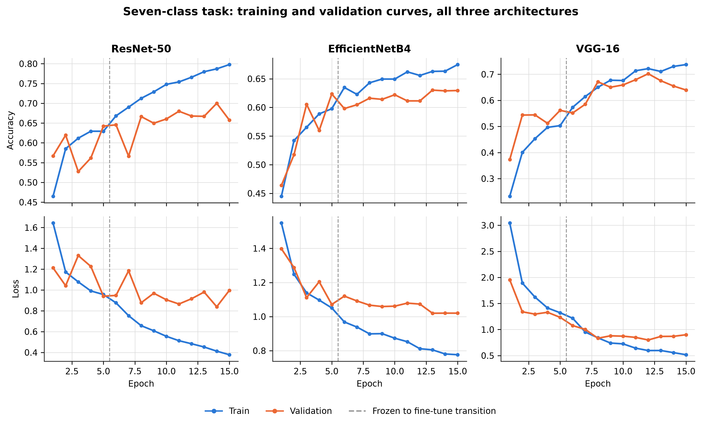

### 4.2.2 Binary Classification Results

Table 4.2 reports each architecture's performance on the binary malignant or benign task, using the joint training strategy described in Chapter 3, which the results below establish as the recommended binary-task model.

**Table 4.2: Binary classification performance, joint training strategy**

| Architecture | Accuracy | Kappa | ROC-AUC |
|---|---|---|---|
| ResNet-50 | 81.7% | 0.502 | 0.879 |
| EfficientNetB4 | 74.3% | 0.410 | 0.873 |
| VGG-16 | 81.5% | 0.492 | 0.881 |

ResNet-50 and VGG-16 performed almost identically on this task, separated by only 0.2 percentage points of accuracy and 0.010 of kappa. EfficientNetB4 trailed both by a wider margin than it did on the seven-class task, 7.2 to 7.4 percentage points of accuracy behind the other two. Figure 4.4 shows accuracy and kappa side by side for all three architectures.

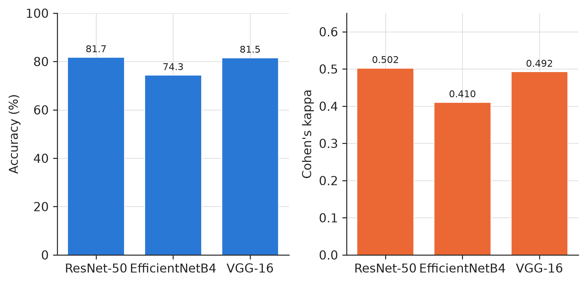

Figure 4.5 shows the corresponding training and validation curves for the binary task's joint training strategy. The same two-phase pattern is visible, and the train and validation gap widens more noticeably here than on the seven-class task: by the final epoch, training accuracy exceeds 0.90 for all three architectures while validation accuracy has plateaued between 0.74 and 0.87, and validation loss for ResNet-50 in particular, after an initial fall through most of the fine-tuning phase, rises again over the final few epochs.

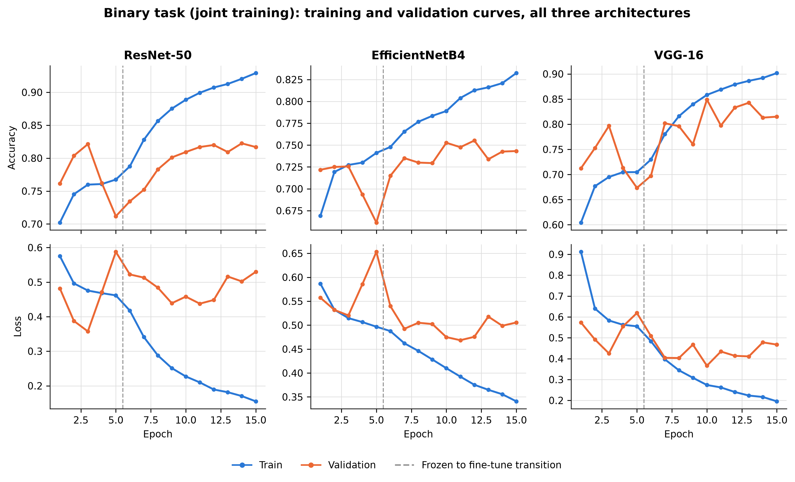

## 4.3 DDI Fairness Evaluation Results

### 4.3.1 Zero-Shot Generalisation Results

Table 4.3 reports each HAM10000-only binary model's performance on the full 656-image DDI set, without any DDI training.

**Table 4.3: Zero-shot generalisation to DDI**

| Architecture | DDI accuracy | DDI kappa | DDI ROC-AUC | HAM10000 malignant recall | DDI malignant recall |
|---|---|---|---|---|---|
| ResNet-50 | 75.3% | 0.159 | 0.654 | 0.799 | 0.158 |
| EfficientNetB4 | 62.5% | 0.138 | 0.592 | 0.871 | 0.480 |
| VGG-16 | 73.2% | 0.090 | 0.598 | 0.799 | 0.123 |

Every architecture's malignant recall collapsed when moving from HAM10000 to DDI without any adaptation, though the size of the collapse varied considerably. VGG-16 showed the largest relative drop, from 0.799 to 0.123. EfficientNetB4 showed both the highest starting recall on HAM10000 (0.871) and the highest recall retained on DDI (0.480), making it the best generaliser of the three architectures on this specific measure despite recording the lowest overall DDI accuracy and kappa.

### 4.3.2 Sequential Fine-Tuning Results

Table 4.4 reports each architecture's performance after fine-tuning its HAM10000-only baseline on DDI's own training split, evaluated on DDI's held-out validation split, together with how much HAM10000 validation accuracy each model retained.

**Table 4.4: Sequential fine-tuning on DDI**

| Architecture | DDI held-out accuracy | DDI held-out kappa | DDI held-out ROC-AUC | HAM10000 retention |
|---|---|---|---|---|
| ResNet-50 | 71.7% | 0.167 | 0.584 | 75.4% |
| EfficientNetB4 | 66.7% | 0.083 | 0.615 | 77.5% |
| VGG-16 | 70.7% | 0.071 | 0.671 | 80.0% |

Fine-tuning did not produce a uniform outcome across architectures. Compared against the zero-shot malignant recall figures in Table 4.3, ResNet-50 and VGG-16 both saw their malignant recall on DDI rise after fine-tuning, while EfficientNetB4's malignant recall fell after fine-tuning despite this being the architecture that generalised best zero-shot. This comparison spans two different evaluation sets, the zero-shot figures are measured on the full 656-image DDI set while the fine-tuned figures are measured on the smaller 99-image held-out split, so the direction of change for each architecture is informative but the exact magnitude should be read with that difference in mind. VGG-16's kappa on the held-out split, 0.071, is the lowest of the three architectures under this strategy, with EfficientNetB4's 0.083 close behind.

### 4.3.3 Joint Training Results

Table 4.5 reports each architecture's performance when trained on HAM10000 and DDI together from the outset, evaluated on the identical DDI held-out split used in Table 4.4.

**Table 4.5: Joint training on HAM10000 and DDI**

| Architecture | DDI held-out accuracy | DDI held-out kappa | DDI held-out ROC-AUC |
|---|---|---|---|
| ResNet-50 | 74.7% | 0.356 | 0.764 |
| EfficientNetB4 | 65.7% | 0.211 | 0.698 |
| VGG-16 | 70.7% | 0.304 | 0.733 |

### 4.3.4 Comparative Summary Across Strategies

Table 4.6 places the three strategies side by side using their kappa scores on the DDI held-out split, since kappa was established in Chapter 3 as the decisive metric for this comparison.

**Table 4.6: Kappa on the DDI held-out split, by strategy and architecture**

| Architecture | Fine-tuned kappa | Joint kappa | Difference |
|---|---|---|---|
| ResNet-50 | 0.167 | 0.356 | +0.189 |
| EfficientNetB4 | 0.083 | 0.211 | +0.128 |
| VGG-16 | 0.071 | 0.304 | +0.233 |

Joint training produced a higher kappa than sequential fine-tuning for every architecture, with the joint model's kappa between approximately 2.1 and 4.3 times the fine-tuned model's kappa depending on architecture. The same ordering holds on ROC-AUC: joint training led fine-tuning by 0.180 for ResNet-50, 0.083 for EfficientNetB4, and 0.062 for VGG-16. Figure 4.6 shows this comparison for all three architectures.

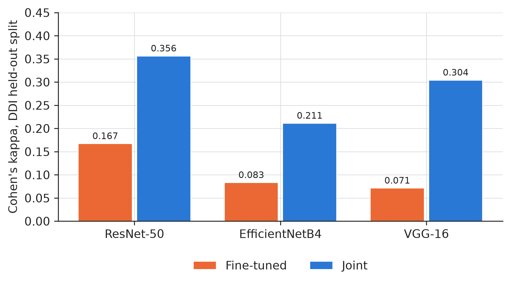

### 4.3.5 Skin-Tone-Stratified Results

Table 4.7 breaks the joint model's DDI held-out accuracy down by Fitzpatrick skin-tone band, using the strategy recommended above.

**Table 4.7: Joint model accuracy by Fitzpatrick skin-tone band, DDI held-out split**

| Architecture | FST I to II | FST III to IV | FST V to VI |
|---|---|---|---|
| ResNet-50 | 68.8% | 72.2% | 83.9% |
| EfficientNetB4 | 56.3% | 75.0% | 64.5% |
| VGG-16 | 71.9% | 63.9% | 77.4% |

Each Fitzpatrick band in this table contains between 31 and 36 images, so these figures should be read as directional rather than precise. No architecture shows a monotonic decline in accuracy from lighter to darker skin tones. ResNet-50's highest accuracy band is FST V to VI, the darkest band, at 83.9%. EfficientNetB4's lowest accuracy band is FST I to II, the lightest band, at 56.3%. VGG-16's lowest band is FST III to IV, the middle band. Figure 4.7 presents these results graphically.

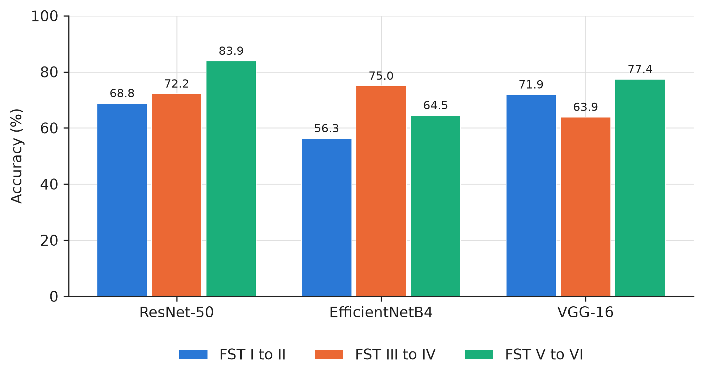

## 4.4 Grad-CAM Faithfulness Results

### 4.4.1 Initial Sample and Correction at Larger Sample Size

Table 4.8 compares each model's Grad-CAM faithfulness score at the original 30-image sample against the same score recomputed at 150 images.

**Table 4.8: Grad-CAM mean IoU, 30-image sample versus 150-image sample**

| Model | n=30 IoU | n=150 IoU | Change |
|---|---|---|---|
| ResNet-50, seven-class | 0.253 | 0.294 | +16.5% |
| ResNet-50, binary | 0.215 | 0.157 | −27.1% |
| EfficientNetB4, seven-class | 0.239 | 0.259 | +8.3% |
| EfficientNetB4, binary | 0.167 | 0.141 | −15.5% |
| VGG-16, seven-class | 0.196 | 0.196 | unchanged |
| VGG-16, binary | 0.154 | 0.115 | −25.2% |

Every binary-task model's faithfulness score fell by between 15.5% and 27.1% when the sample size increased from 30 to 150 images. Every seven-class model's score either rose or stayed the same over the same increase. This pattern, a consistent direction of change within each task rather than a mix of increases and decreases across all six models, is consistent with the binary task's smaller pool of validation images making a 30-image sample less representative of that task specifically, rather than with a general unreliability affecting all six models equally. Figure 4.8 presents both tasks side by side.

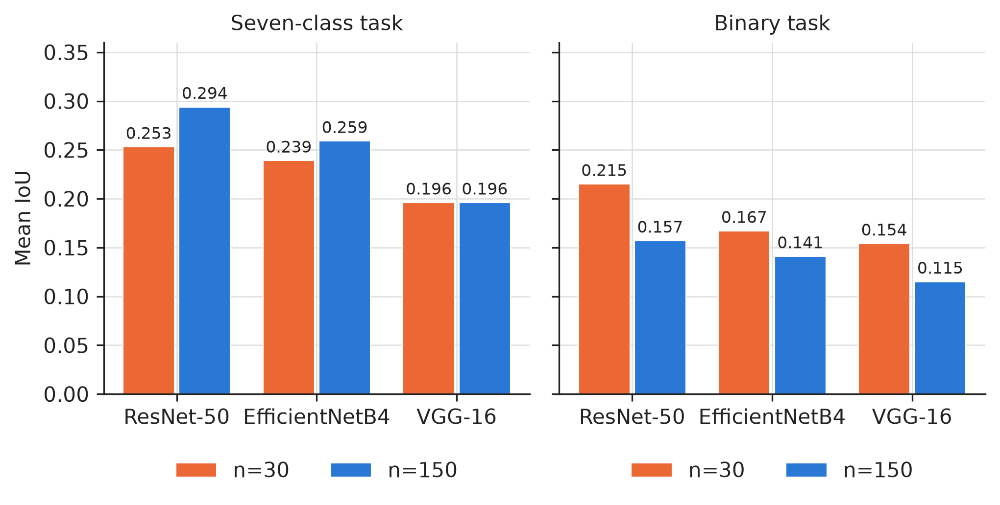

## 4.5 SHAP versus Grad-CAM Faithfulness Results

### 4.5.1 Comparison Across Sample Sizes

Table 4.9 reports the mean IoU achieved by Grad-CAM and by SHAP for each architecture, at each sample size tested, culminating in the largest sample size that could be run for each architecture given the memory constraint described in Chapter 3.

**Table 4.9: Grad-CAM and SHAP mean IoU across sample sizes**

| Architecture | n | Grad-CAM IoU | SHAP IoU |
|---|---|---|---|
| ResNet-50 | 15 | 0.293 | 0.259 |
| ResNet-50 | 150 | 0.294 | 0.215 |
| ResNet-50 | 500 | 0.305 | 0.208 |
| EfficientNetB4 | 15 | 0.185 | 0.273 |
| EfficientNetB4 | 150 | 0.259 | 0.255 |
| EfficientNetB4 | 400 | 0.255 | 0.241 |
| VGG-16 | 15 | 0.200 | 0.218 |
| VGG-16 | 150 | 0.195 | 0.255 |
| VGG-16 | 500 | 0.202 | 0.255 |

ResNet-50's Grad-CAM score exceeded its SHAP score at every sample size tested, and the size of that gap grew slightly as the sample size increased, from 0.034 at 15 images to 0.097 at 500 images. VGG-16's SHAP score exceeded its Grad-CAM score at every sample size tested, growing from a narrow 0.018 at 15 images to 0.053 at 500 images. EfficientNetB4 is the only architecture whose ranking changed with sample size: Grad-CAM trailed SHAP by 0.088 at 15 images, then led SHAP by 0.004 at 150 images and by 0.014 at 400 images. Figure 4.9 traces each architecture's two scores across every sample size tested.

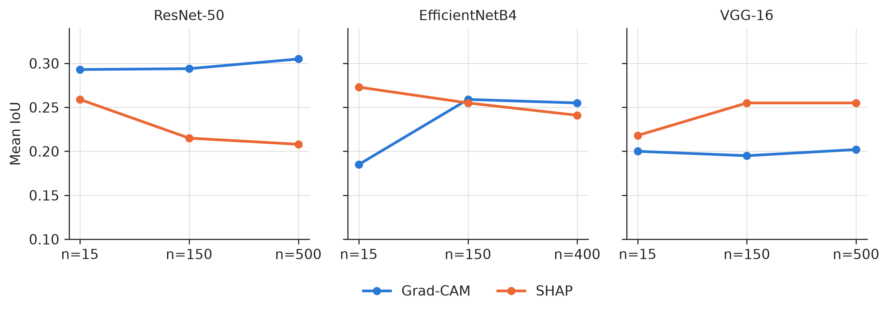

Figure 4.10 makes this architecture dependence concrete with a real example from each of the two directional cases. For a correctly classified melanoma image, ResNet-50's Grad-CAM heatmap sits tightly on the lesion (IoU 0.512) while its SHAP attribution spreads beyond it (IoU 0.291). For a correctly classified nevus image, the pattern reverses: VGG-16's Grad-CAM heatmap drifts partly off the lesion (IoU 0.190) while its SHAP attribution concentrates on it (IoU 0.564). Both examples use the same two methods, scored the same way, on comparably sized lesions, so the reversal reflects a genuine architecture effect rather than an artefact of image difficulty.

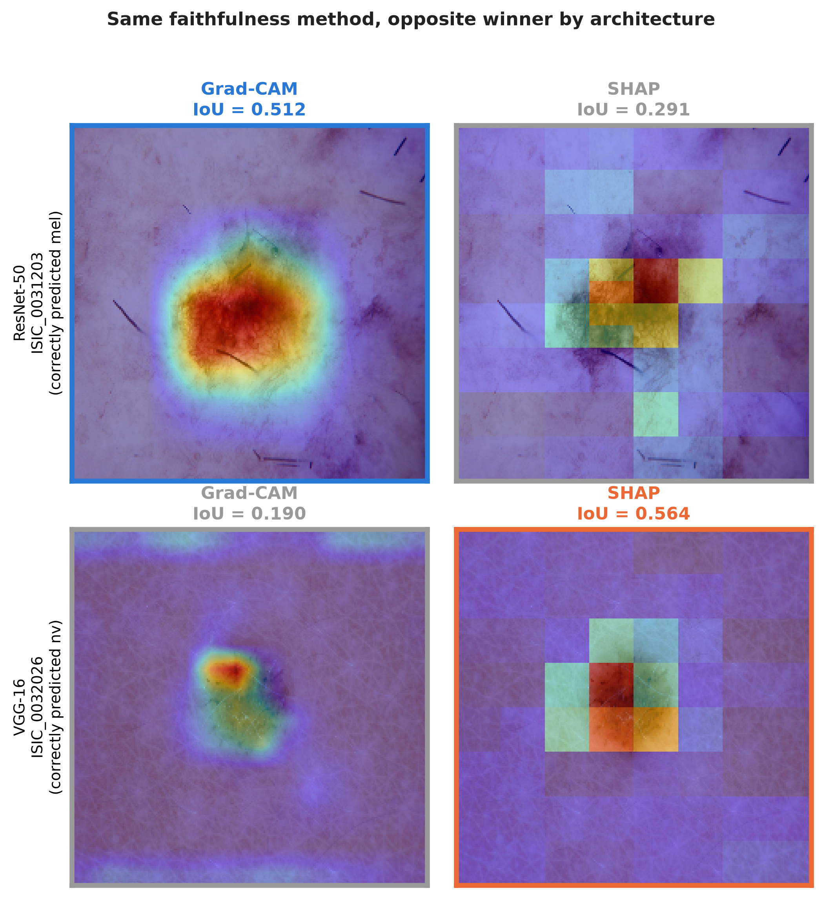

### 4.5.2 Confidence Interval Analysis

To determine whether the differences in Table 4.9 reflect a genuine effect rather than sampling noise, the per-image difference between each model's Grad-CAM and SHAP IoU was computed at the largest sample size run for each architecture, and used to construct a paired 95% confidence interval on the mean difference. Table 4.10 reports the result.

**Table 4.10: Paired 95% confidence interval on the Grad-CAM minus SHAP IoU gap**

| Architecture | n | Mean gap | 95% confidence interval | Excludes zero |
|---|---|---|---|---|
| ResNet-50 | 500 | +0.097 | 0.078 to 0.115 | Yes |
| VGG-16 | 500 | −0.053 | −0.067 to −0.038 | Yes |
| EfficientNetB4 | 400 | +0.014 | −0.003 to 0.032 | No |
| EfficientNetB4 | 200 | +0.007 | −0.018 to 0.032 | No |

ResNet-50's and VGG-16's confidence intervals both exclude zero, in opposite directions, indicating a statistically supported difference between the two explainability methods for each of these two architectures. EfficientNetB4's confidence interval includes zero at both sample sizes tested, 400 and 200 images, indicating that the two methods cannot be distinguished for this architecture at either sample size. Since this result was obtained independently at two different sample sizes with the same outcome, it is treated as a stable finding for this architecture rather than as a result that a still larger sample might yet resolve one way or the other. Figure 4.11 presents all four intervals on a common scale, with the dashed line marking zero.

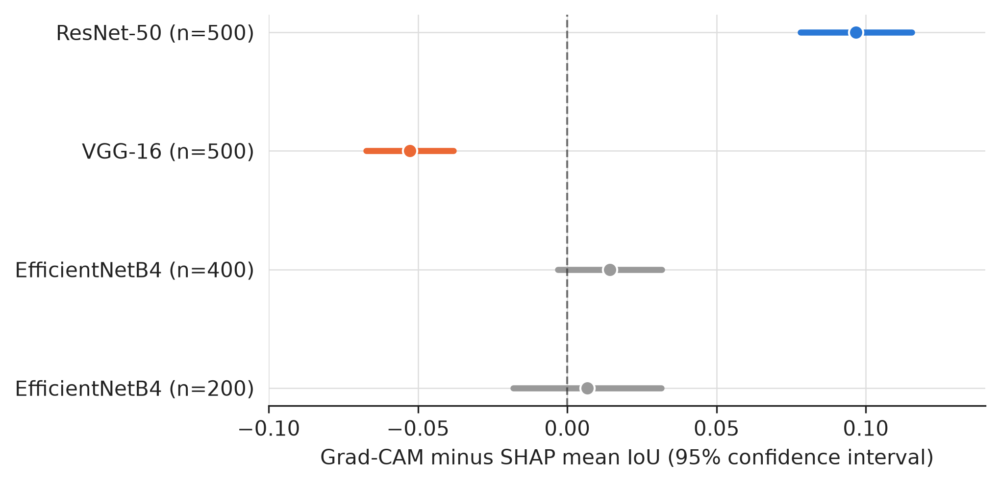

## 4.6 Robustness Checks on the DDI Strategy Comparison and Architecture Ranking

The headline results above, that joint training outperforms the other two DDI strategies for every architecture (Section 4.3), and that ResNet-50 and VGG-16 lead EfficientNetB4 on the resulting DDI held-out kappa (Table 4.6), were each checked a further way before being treated as settled findings, consistent with the verify-at-scale approach Chapter 3 also applied to the explainability comparison. Four checks are reported in this section: whether the architecture ranking survives training the joint model again from a different random initialisation (Section 4.6.1); how that training-run variance compares with the sampling uncertainty already present in a single seed's own estimate (Section 4.6.2); whether the joint model's advantage survives giving every strategy its own fairest decision threshold rather than the uncalibrated 0.5 default used throughout Section 4.3 (Section 4.6.3); and whether that calibrated advantage is large enough to pass a formal paired significance test given DDI's small size (Section 4.6.4).

### 4.6.1 Multi-Seed Variance Check

Every result reported in Section 4.3 for the joint DDI training strategy came from a single trained model per architecture. To check whether the DDI held-out kappa figures in Table 4.5, and the architecture ranking they imply, reflect a stable property of each architecture rather than one favourable or unfavourable training run, two additional, independently trained seeds were run for each architecture's joint binary model, using the identical data split, augmentation pipeline, and training procedure described in Chapter 3. Only the random initialisation of the model's weights and its dropout differ between seeds; the lesion-level data split itself is fixed by a separate seed elsewhere in the pipeline and was not varied here, so this check captures training-run variance specifically rather than a full multi-seed study that would also vary the data split.

**Table 4.11: DDI held-out Cohen's kappa, joint training strategy, across three independently trained seeds**

| Architecture | Seed 1 (Table 4.5) | Seed 2 | Seed 3 | Mean | Standard deviation |
|---|---|---|---|---|---|
| ResNet-50 | 0.356 | 0.361 | 0.305 | 0.340 | 0.031 |
| VGG-16 | 0.304 | 0.340 | 0.304 | 0.316 | 0.021 |
| EfficientNetB4 | 0.211 | 0.273 | 0.256 | 0.246 | 0.032 |

The ranking established in Table 4.6, ResNet-50 ahead of VGG-16 ahead of EfficientNetB4, holds for every pairwise comparison in all three seeds. ResNet-50 beats EfficientNetB4 by a clear margin in every seed, 0.145, 0.088, and 0.049. ResNet-50 also beats VGG-16 in every seed, but that margin narrows from 0.052 in the first seed to 0.021 in the second and to essentially zero, 0.001, in the third. VGG-16 beats EfficientNetB4 in every seed.

Training-run variance, on this evidence, is modest: across the three seeds, ResNet-50's kappa varies by a standard deviation of 0.031, VGG-16's by 0.021, and EfficientNetB4's by 0.032. What this check does establish is that the ranking in Table 4.6 is not an artefact of one favourable training run for ResNet-50, since the same ordering reappears across three separately initialised and trained models. The ResNet-50 versus VGG-16 gap specifically is the one result this check weakens rather than strengthens: it should be read as a narrow, seed-sensitive lead for ResNet-50 rather than a confident distinction between the two architectures, whereas both architectures' lead over EfficientNetB4 held clearly in every seed tested.

This check is scoped narrowly to training-initialisation variance, since the lesion-level data split and shuffle order were both held fixed across all three seeds by construction. Whether the same ranking would survive a different data split, a broader form of multi-seed variance, has not been tested and is noted as future work in Chapter 5, along with extending this check to the seven-class task and to the zero-shot and fine-tuned DDI strategies, neither of which has yet received an equivalent check.

### 4.6.2 Sampling Uncertainty via Bootstrap Confidence Intervals

The training-run variance found in Section 4.6.1 is small next to the sampling uncertainty already present in a single seed's own estimate. A percentile bootstrap (2,000 resamples) on seed 1's joint-model DDI held-out kappa produces a 95% confidence interval approximately 0.42 wide for ResNet-50 (0.135 to 0.551), 0.39 wide for EfficientNetB4 (0.007 to 0.400), and 0.40 wide for VGG-16 (0.102 to 0.503), an order of magnitude wider than the 0.021 to 0.032 standard deviation observed across the three training seeds in Table 4.11. The two checks answer different questions: the multi-seed check asks whether a different trained model would give a different answer, and the answer is largely no; the bootstrap check asks whether a different held-out sample would give a different answer, and the answer is yes, substantially so. DDI's 99-image held-out split, not training-run stochasticity, is therefore the dominant source of uncertainty in this study's DDI held-out kappa figures, and is a further, independent reason the ResNet-50 versus VGG-16 margin should be read cautiously.

### 4.6.3 Threshold Calibration

Every result reported in Section 4.3 used the standard 0.5 decision threshold. Since DDI's benign class forms the majority of labels even within the held-out split, a model's default threshold need not be the one that best separates malignant from benign, so each architecture's predicted probabilities on the DDI held-out split were swept across thresholds from 0.05 to 0.95 in steps of 0.05, for all three DDI strategies, and the threshold maximising kappa was recorded for each. Table 4.12 reports the result for the joint strategy, the strategy recommended above.

**Table 4.12: Joint strategy, DDI held-out kappa at the default 0.5 threshold versus each architecture's own kappa-maximising threshold**

| Architecture | Default (0.5) kappa | Default accuracy | Best threshold | Best kappa | Best accuracy |
|---|---|---|---|---|---|
| ResNet-50 | 0.356 | 74.7% | 0.75 | 0.431 | 78.8% |
| EfficientNetB4 | 0.211 | 65.7% | 0.90 | 0.347 | 78.8% |
| VGG-16 | 0.304 | 70.7% | 0.95 | 0.396 | 77.8% |

For every architecture, moving to its own best threshold raised kappa and accuracy together, with no trade-off between the two: this is a genuine, free improvement available on the already-trained joint models without any further training, simply by changing the post-hoc decision rule. All three best thresholds sit well above 0.5, reflecting the DDI held-out split's own imbalance toward benign; a threshold this far above 0.5 would not necessarily be appropriate for a differently balanced population, and no claim is made here that these specific thresholds should be adopted outside this study's evaluation split.

Applying the same threshold sweep to the zero-shot and fine-tuned strategies checks whether joint training's advantage in Table 4.6 was itself partly an artefact of the alternatives using a poorly calibrated default threshold. Table 4.13 reports each strategy's best-calibrated kappa.

**Table 4.13: Best-calibrated DDI held-out kappa, all three strategies**

| Architecture | Joint (best) | Zero-shot (best) | Fine-tuned (best) |
|---|---|---|---|
| ResNet-50 | 0.431 | 0.180 | 0.249 |
| EfficientNetB4 | 0.347 | 0.232 | 0.208 |
| VGG-16 | 0.396 | 0.228 | 0.200 |

Joint training remains clearly ahead of both alternatives for every architecture even once every strategy is given its own fairest threshold; if anything, the gap between joint and the alternatives widens compared with the uncalibrated comparison in Table 4.6. This rules out an uncalibrated default threshold as the explanation for joint training's advantage: the advantage reflects a genuine difference in each model's underlying discrimination ability, not an artefact of where the decision boundary happened to sit by default.

### 4.6.4 Paired Significance Test (McNemar's)

Because all three strategies for a given architecture are evaluated on the identical 99 DDI held-out images, a paired test has more statistical power to detect a real difference than the independent-sample comparisons above. McNemar's exact binomial test was applied to each pairwise comparison's uncalibrated (0.5-threshold) correctness, for every architecture.

**Table 4.14: McNemar's exact test p-values, DDI held-out predictions, all three architectures**

| Comparison | ResNet-50 | EfficientNetB4 | VGG-16 |
|---|---|---|---|
| Joint vs. zero-shot | 1.000 | 0.701 | 0.860 |
| Joint vs. fine-tuned | 0.678 | 1.000 | 1.000 |
| Zero-shot vs. fine-tuned | 0.688 | 0.481 | 0.727 |

Every p-value in Table 4.14 is well above the conventional 0.05 threshold; no pairwise comparison, for any architecture, reaches statistical significance under this test. The number of discordant pairs behind each test ranges from only 6 to 32 out of 99 held-out images, too few, given DDI's overall size, for this more statistically appropriate paired test to confirm what the kappa point estimates and the calibrated comparison in Table 4.13 both suggest is a real difference. This is not a contradiction of the findings above: a kappa-based comparison and a significance test on raw correctness are different measures, and the honest combined reading is that joint training's advantage is directionally consistent across every check applied in this section, the calibrated comparison, the multi-seed check, and the original uncalibrated comparison alike, while DDI's small size means no single formal significance test run on this dataset can currently rule out chance at the conventional 0.05 threshold.

## 4.7 Summary of Findings

ResNet-50 achieved the strongest seven-class validation performance and joint binary performance among the three architectures, though its lead over VGG-16 was narrow on most metrics, and VGG-16 achieved the strongest ISIC2018 test accuracy. EfficientNetB4 trailed both architectures on nearly every classification metric, on both tasks. A bootstrap check on the seven-class ranking (Table 4.1b) found all three architectures' confidence intervals overlap on both accuracy and kappa, so this ranking should be read as the best point estimate available from a single validation run rather than a statistically confirmed ordering.

Across all three DDI incorporation strategies, joint training produced the highest kappa on the DDI held-out split for every architecture, by a substantial margin over sequential fine-tuning in every case. Zero-shot evaluation on the full DDI set showed a severe collapse in malignant recall for every architecture, of differing sizes, with EfficientNetB4 retaining the most malignant recall despite being the weakest architecture by several other measures. Four robustness checks on this comparison (Section 4.6) converge on the same directionally consistent picture: joint training's advantage survives calibrating every strategy to its own fairest threshold, and if anything widens; the resulting architecture ranking, ResNet-50 and VGG-16 both ahead of EfficientNetB4, held stable across three independently trained models, though the ResNet-50-versus-VGG-16 gap specifically was small enough in one of those three seeds to be read as a near-tie rather than a confident distinction; and DDI's 99-image held-out split is the dominant source of uncertainty in these figures, large enough that no formal paired significance test run on this dataset reaches significance at the conventional threshold, even though every other check points the same direction.

Grad-CAM faithfulness scores computed on a small sample were shown not to be reliable on their own: every binary-task model's score changed substantially, always downward, when the sample size was increased from 30 to 150 images. This same sensitivity was found again in the SHAP comparison, where an apparent SHAP advantage for EfficientNetB4 at 15 images did not survive scaling to 150, 200, or 400 images, while a smaller apparent SHAP advantage for VGG-16 at 15 images held and grew at every larger sample size tested. The confidence interval analysis in Table 4.10 supports two directional findings, ResNet-50 favouring Grad-CAM and VGG-16 favouring SHAP, and one genuine tie, EfficientNetB4 showing no reliable difference between the two methods.
