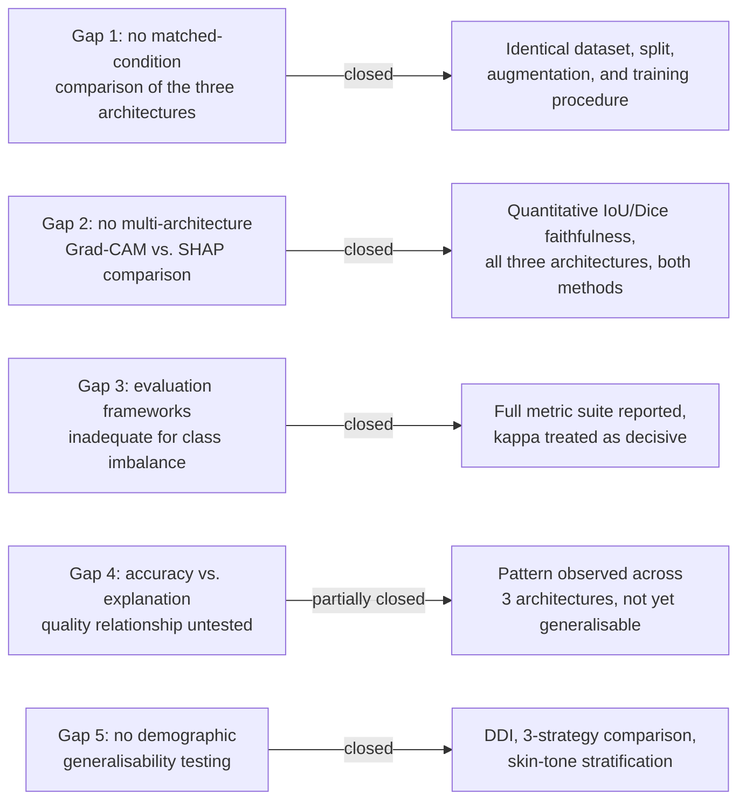

# Chapter 5: Discussion, Conclusion, and Future Work

## 5.1 Introduction

This chapter interprets the results presented in Chapter 4 against the claims, gaps, and prior studies discussed in the literature review, draws conclusions about what the study has and has not established, states the limitations that should temper those conclusions, and sets out the work that would be needed to extend it. The chapter is organised in three parts: a discussion of the findings by theme, a set of limitations that apply across all three themes, and a conclusion that closes with recommendations for future work.

## 5.2 Discussion

### 5.2.1 Classification Performance in Relation to Prior Work

ResNet-50 and VGG-16 achieved broadly comparable performance on both tasks, with EfficientNetB4 trailing on every classification metric reported in Chapter 4. This is a smaller and more mixed set of differences than the literature review's own comparative summary might suggest. Tahir et al. (2023) reported seven-class-adjacent accuracies in the high 80s and low 90s, and Aburaed et al. (2020) reported accuracies as high as 99%, both well above the 61 to 66 percent range achieved here.

This gap is expected rather than concerning, once the underlying datasets are compared rather than the headline numbers alone. Tahir et al. (2023) evaluated a four-class subset of the diagnostic space, a task with fewer opportunities for the kind of inter-class confusion that a seven-class problem introduces. Aburaed et al. (2020) removed approximately 5,000 nevus images before training and testing, producing a dataset close to 1,000 images per class rather than HAM10000's native, heavily skewed distribution. Both changes make the underlying classification problem easier, independent of any difference in architecture. The present study evaluated all three architectures on the complete, unaltered seven-class HAM10000 distribution specifically so that its accuracy figures would reflect the full difficulty of the original dataset, including its class imbalance, rather than a version of the task that has been made easier before results are reported. Read this way, the lower accuracy figures obtained here are a consequence of a harder and more faithfully representative task, not evidence of weaker models, and the critical point raised in the literature review, that accuracy figures computed on differently prepared versions of HAM10000 cannot be compared directly, is borne out by this study's own results sitting well below figures obtained on artificially eased versions of the same dataset.

On the binary task, ROC-AUC values of 0.873 to 0.881 sit below the AUC above 0.91 reported by Esteva et al. (2017) and the 0.86 reported by Haenssle et al. (2018). Both of those studies evaluated narrower binary distinctions on curated or proprietary image sets. The binary task used here combines a relabelled seven-class corpus with DDI, spans a wider range of malignant subtypes than a single melanoma-versus-nevus distinction, and evaluates across a broader range of skin tones than either prior study attempted. A lower AUC on a broader, more demographically varied task is consistent with, rather than contradictory to, the two studies' own results.

### 5.2.2 DDI Fairness Strategies in Relation to Prior Work

Daneshjou et al. (2022) identified the absence of testing across darker Fitzpatrick skin types as a critical flaw in the dermatology AI literature. The zero-shot results in this study support that concern directly: every architecture's malignant recall collapsed when its HAM10000-only model was evaluated on DDI without adaptation, from a range of 0.799 to 0.871 down to 0.123 to 0.480. This confirms, as a measured finding rather than an assumption, that a model trained only on HAM10000 does not generalise safely to a more diverse population.

The comparison across all three strategies goes further than a diagnosis of the problem. Joint training, in which HAM10000 and DDI are combined from the start of training, produced a substantially higher kappa on DDI's held-out split than sequential fine-tuning for every architecture, between 1.5 and 4.3 times higher depending on architecture. This result should be read as evidence that a specific, practical training choice measurably reduces the generalisation gap Daneshjou et al. (2022) identified, without claiming that the gap is closed. DDI remains far smaller than HAM10000, and the joint model's DDI kappa, at best 0.356, remains well below its own HAM10000 kappa.

The skin-tone-stratified results complicate a simple reading of this fairness problem. None of the three architectures showed a monotonic decline in accuracy from lighter to darker Fitzpatrick bands under joint training; in ResNet-50's case, the darkest band achieved the highest accuracy of the three. Given that each band contains only 31 to 36 images, this should not be read as evidence that darker skin tones are easier for these models, only as evidence that the relationship between skin tone and accuracy, at this sample size, is not the simple monotonic pattern a reader might expect from the zero-shot result alone. This is exactly the kind of finding that a larger stratified sample, discussed later in this chapter, would be needed to confirm or overturn.

### 5.2.3 Explainability Findings in Relation to Prior Work

Hauser et al. (2022) found that the large majority of studies applying an XAI method to dermatological images did not evaluate the resulting explanation in any way, and that only a small minority validated their explanations against an independent standard. The faithfulness methodology used in this study, scoring both Grad-CAM and SHAP against HAM10000's ground-truth lesion masks using IoU and Dice, was designed as a direct response to that finding, and the results in Chapter 4 show why that check matters in practice. An unvalidated 15-image comparison suggested that SHAP was more faithful than Grad-CAM for EfficientNetB4; a properly powered comparison at 150, 200, and 400 images showed the two methods to be statistically indistinguishable for that architecture. Had the smaller sample been reported without the later check, this study would have repeated exactly the pattern Hauser et al. (2022) documented: an explanation method result asserted without adequate validation.

The confidence interval analysis also speaks to the fourth gap identified in the literature review, whether classification accuracy and explanation quality are related. EfficientNetB4, the weakest architecture on both classification tasks, is also the architecture for which no reliable difference between Grad-CAM and SHAP could be established. ResNet-50 and VGG-16, whose classification performance was close to each other and ahead of EfficientNetB4, each showed a clear and statistically supported preference for one method over the other, in opposite directions. With only three architectures compared, this is not sufficient evidence to claim a general relationship between classification accuracy and explanation faithfulness, but it is evidence against the simplest possible relationship, that a more accurate model's explanations are consistently more faithful by one method or the other, since ResNet-50 and VGG-16 diverge from each other despite both outperforming EfficientNetB4.

### 5.2.4 Revisiting the Gaps Identified in the Literature Review

The first gap, the absence of a controlled comparison of ResNet-50, EfficientNetB4, and VGG-16 on the full seven-class HAM10000, is addressed directly: all three architectures were trained and evaluated under an identical dataset, split, augmentation pipeline, and training procedure, and the resulting differences, summarised above, can be attributed to architecture rather than to differing dataset preparation.

The second gap, the absence of a study combining classification performance with a quantitative, multi-architecture comparison of Grad-CAM and SHAP, is addressed by the faithfulness results in Chapter 4, which cover both methods across all three architectures using a shared, quantitative scoring procedure rather than visual inspection alone.

The third gap, evaluation frameworks inadequate for an imbalanced dataset, is addressed by reporting the full metric suite, accuracy, per-class precision, recall, and F1, ROC-AUC, and Cohen's kappa, for every model, and by treating kappa rather than accuracy as decisive wherever imbalance could make accuracy misleading, most visibly in the DDI strategy comparison discussed above.

The fourth gap, the unexamined relationship between classification accuracy and explanation quality, is addressed only partially, as discussed above. A pattern was observed across three architectures, but three architectures is too small a sample to generalise from with confidence.

The fifth gap, the absence of demographic generalisability testing, is addressed by DDI's inclusion and the zero-shot, fine-tuning, and joint comparisons built around it, though the skin-tone-stratified results themselves remain limited by DDI's small size. Figure 5.1 summarises how each gap was addressed and to what degree.

*Figure 5.1: How each gap identified in the literature review was addressed, and to what degree.*

## 5.3 Limitations

Several limitations apply across the findings discussed above and should be kept in view when weighing their strength.

Each architecture was trained once per task, using a single random seed. No variance across repeated training runs is reported in Chapter 4, so a difference between architectures that appears clear in this study's single run cannot yet be distinguished from run-to-run variance that a repeated-seed experiment might reveal. A multi-seed check for the binary joint models has been started as a separate, ongoing line of investigation, but its results are not part of the findings discussed above.

The skin-tone-stratified results discussed above are drawn from Fitzpatrick bands of 31 to 36 images each, small enough that the non-monotonic pattern observed should be treated as suggestive rather than conclusive.

EfficientNetB4's SHAP faithfulness evaluation was capped at 400 images rather than the 500 used for the other two architectures, because of a memory constraint tied to its larger input resolution. This asymmetry is unlikely to explain the tie observed for EfficientNetB4, since the same tie held independently at 200 images as well as 400, but it means the three architectures were not evaluated at a perfectly matched sample size.

Grad-CAM and SHAP were scored quantitatively only against HAM10000-derived predictions, since DDI provides no equivalent ground-truth segmentation mask. Any explanation produced for a DDI-derived prediction in the course of this project's XAI generation stage was assessed visually only, and no quantitative faithfulness claim is made about those explanations.

The IoU and Dice faithfulness scores used throughout this study measure whether an explanation's highlighted region overlaps the ground-truth extent of the lesion. This is a meaningful, checkable proxy for one aspect of explanation quality, but it is not the same as clinical interpretability. No dermatologist or other clinical expert reviewed any explanation produced in this study, so the gap Hauser et al. (2022) identified between producing an explanation and validating it against clinical judgement is narrowed by this study's quantitative check, not closed by it.

The binary task's malignant and benign grouping, in which actinic keratosis is treated as malignant, follows one defensible convention but is not the only one used in the published literature; this grouping was not independently confirmed with a clinical supervisor before the results in Chapter 4 were produced. DDI's precise licence terms had also not been independently verified against its official release documentation at the time of writing.

Finally, this project remains explicitly non-clinical throughout. No result reported in Chapter 4, and no discussion in this chapter, should be read as evidence that any of the six trained models are fit for clinical use.

## 5.4 Conclusion

This study compared ResNet-50, EfficientNetB4, and VGG-16 on two dermoscopic classification tasks under matched dataset and training conditions, extended the binary task's evaluation to a dedicated fairness comparison using the DDI dataset, and applied a quantitative, sample-size-verified faithfulness check to Grad-CAM and SHAP across all three architectures. ResNet-50 and VGG-16 performed comparably to one another and ahead of EfficientNetB4 on both classification tasks. Joint training on HAM10000 and DDI together produced a substantially fairer and more effective binary model than either evaluating a HAM10000-only model directly on DDI or fine-tuning it afterward, for every architecture tested. Explainability faithfulness proved to be architecture-dependent rather than fixed: ResNet-50's explanations were more faithful under Grad-CAM, VGG-16's under SHAP, and EfficientNetB4 showed no reliable difference between the two methods once evaluated at an adequately large and independently checked sample size.

Taken together, these results close, or partially close, each of the five gaps identified in the literature review, while surfacing a methodological point that extends beyond any single result: an explainability or fairness comparison computed on a small sample is not safe to report at face value, and should be checked against a larger sample, and ideally a formal interval estimate, before being treated as a finding.

## 5.5 Recommendations for Future Work

The clearest next step is clinical validation of the explanations this study scored only computationally. Hauser et al. (2022) found that almost none of the studies they reviewed took this step; recruiting dermatologists to judge whether Grad-CAM's or SHAP's highlighted regions correspond to clinically meaningful reasoning, rather than only to the ground-truth lesion boundary, would close the interpretability gap this study narrows but does not close.

The multi-seed variance check already begun for the binary joint models should be completed and extended to the seven-class task and to the other two DDI strategies, so that the architecture differences reported in this study can be checked against run-to-run variance rather than read from a single training run per configuration.

SHAP was applied only to the seven-class task in this study, since its output format did not obviously match the binary task's single-output classification head. Resolving that mismatch and extending the SHAP faithfulness comparison to the binary task would complete the explainability comparison this study began.

DDI's skin-tone-stratified results would benefit from a larger sample, either through a larger diverse-skin-tone dataset than DDI currently provides or through pooling DDI with a comparable dataset, so that the non-monotonic pattern observed earlier in this chapter can be confirmed or overturned with a stratified sample larger than the 31 to 36 images per band available here.

Finally, the architecture-specific explainability result for VGG-16, whose explanations were more faithful under SHAP by a margin that held and grew across every sample size tested, is not yet explained mechanistically. Investigating why VGG-16 in particular favours SHAP, for instance through its lack of the skip connections present in ResNet-50, would turn this study's statistical finding into a more general, architecturally grounded one.
